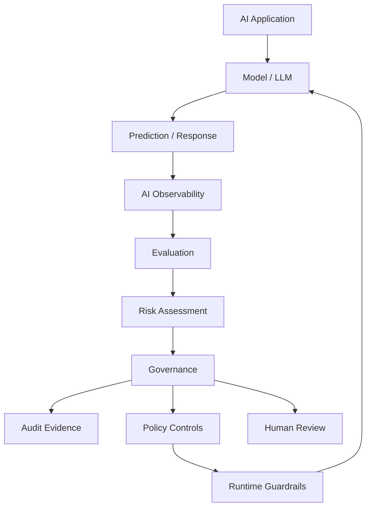
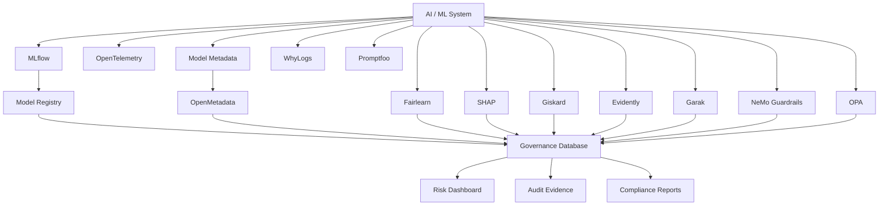
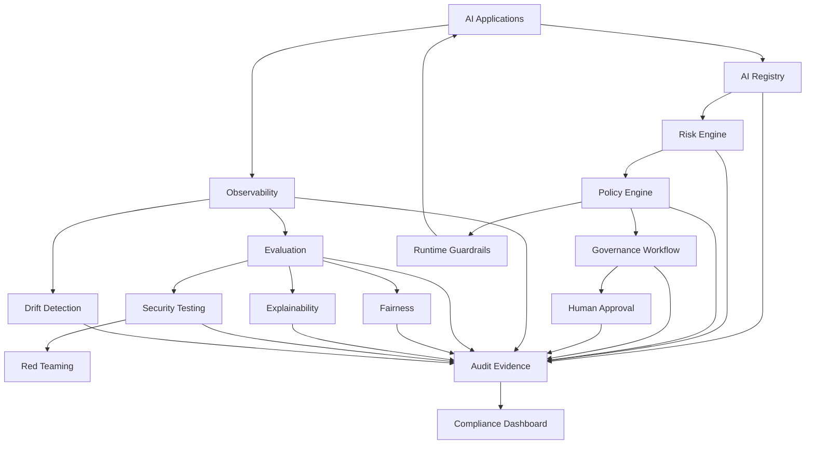

# Awesome-Responsible-AI-Platform

# 🤖 Top Responsible AI Platforms & Open-Source Responsible AI


> A curated list of **Responsible AI, AI Governance, Model Risk Management, AI Compliance, Fairness, Explainability, AI Safety, Model Monitoring and open-source Responsible AI software**.


Responsible AI is the set of practices, technologies and governance processes used to ensure that AI systems are:


* Fair

* Explainable

* Transparent

* Accountable

* Safe

* Robust

* Privacy-preserving

* Secure

* Compliant

* Auditable

* Human-centered


The modern Responsible AI stack extends far beyond model fairness. It increasingly includes **AI inventories, risk classification, regulatory mapping, model documentation, evaluation, bias testing, explainability, monitoring, red-teaming, runtime guardrails, audit evidence and governance workflows**.


The commercial market is led by platforms such as **Credo AI, Holistic AI, FairNow, Monitaur, Truera, Fiddler AI, SAS Responsible AI, IBM watsonx.governance, Microsoft Responsible AI tooling and DataRobot AI Governance**.


At the same time, there is a rapidly growing open-source ecosystem covering individual layers of the Responsible AI lifecycle.


> **Important:** there is currently no single open-source project that completely replaces an enterprise Responsible AI governance platform. A realistic open-source alternative is a **composable stack** combining fairness, explainability, evaluation, monitoring, documentation, security, testing and policy infrastructure.


---


## 📑 Table of Contents


* [☁️ SaaS/Hosted Platforms](#️-saashosted-platforms)

* [🌍 Open-Source](#-open-source)

* [⚖️ Open-Source Fairness & Bias Assessment](#️-open-source-fairness--bias-assessment)

* [🔍 Open-Source Explainable AI](#-open-source-explainable-ai)

* [🧪 Open-Source AI Evaluation & Testing](#-open-source-ai-evaluation--testing)

* [📊 Open-Source Model Monitoring](#-open-source-model-monitoring)

* [🛡️ Open-Source AI Safety & Guardrails](#️-open-source-ai-safety--guardrails)

* [🔴 Open-Source AI Red Teaming](#-open-source-ai-red-teaming)

* [📋 Open-Source Model Cards & Documentation](#-open-source-model-cards--documentation)

* [🗂️ Open-Source Model Registries & Governance](#️-open-source-model-registries--governance)

* [🔐 Open-Source Privacy & Responsible Data](#-open-source-privacy--responsible-data)

* [🔒 Open-Source AI Security](#-open-source-ai-security)

* [🧠 Open-Source LLM Evaluation](#-open-source-llm-evaluation)

* [🤖 Open-Source Agent Evaluation & Governance](#-open-source-agent-evaluation--governance)

* [🏗️ Open-Source MLOps & AI Lifecycle](#️-open-source-mlops--ai-lifecycle)

* [📜 Open-Source AI Policy & Compliance](#-open-source-ai-policy--compliance)

* [🧩 Commercial Platform → Open-Source Equivalent](#-commercial-platform--open-source-equivalent)

* [🏗️ Responsible AI Architecture](#️-responsible-ai-architecture)

* [🔄 Open-Source Responsible AI Architecture](#-open-source-responsible-ai-architecture)

* [🧪 Responsible AI Lifecycle](#-responsible-ai-lifecycle)

* [🛡️ AI Governance Control Plane](#️-ai-governance-control-plane)

* [⚖️ Commercial vs Open-Source](#️-commercial-vs-open-source)

* [🚀 Recommended Open-Source Stacks](#-recommended-open-source-stacks)

* [📊 Responsible AI Technology Comparison](#-responsible-ai-technology-comparison)

* [🎯 Recommended Projects by Use Case](#-recommended-projects-by-use-case)

* [🏢 Building a Credo AI Alternative](#-building-a-credo-ai-alternative)

* [🏛️ Building an Open-Source AI Governance Platform](#️-building-an-open-source-ai-governance-platform)

* [🌐 Open-Source Responsible AI Landscape](#-open-source-responsible-ai-landscape)

* [🧠 Why Open-Source Responsible AI Matters](#-why-open-source-responsible-ai-matters)

* [🤝 Contributing](#-contributing)

* [⚠️ Disclaimer](#️-disclaimer)


---


# ☁️ SaaS/Hosted Platforms


Commercial Responsible AI platforms typically combine some combination of **AI inventory, risk assessment, policy management, compliance mapping, model validation, fairness, explainability, monitoring, documentation and audit evidence**.


| Platform                                                                  | Company         | Primary Focus                 | Key Capabilities                                                                      |

| ------------------------------------------------------------------------- | --------------- | ----------------------------- | ------------------------------------------------------------------------------------- |

| [Credo AI](https://www.credo.ai/)                                         | Credo AI        | AI Governance                 | AI inventory, risk assessment, policy packs, regulatory mapping, governance workflows |

| [Holistic AI](https://www.holisticai.com/)                                | Holistic AI     | Responsible AI Governance     | AI auditing, bias, risk, compliance, monitoring and AI safety                         |

| [FairNow / Optro](https://fairnow.ai/)                                    | FairNow / Optro | AI Governance                 | AI inventory, model risk, regulatory compliance and governance                        |

| [Monitaur](https://www.monitaur.ai/)                                      | Monitaur        | AI Governance & Model Risk    | Model governance, risk, controls, validation, monitoring and audit evidence           |

| [Truera](https://www.truera.com/)                                         | TruEra          | AI Quality & Explainability   | Explainability, model quality, monitoring and AI evaluation                           |

| [Fiddler AI](https://www.fiddler.ai/)                                     | Fiddler AI      | AI Observability & Governance | Explainability, monitoring, fairness, LLM observability, governance and security      |

| [SAS Responsible AI](https://www.sas.com/)                                | SAS             | Enterprise AI Governance      | Model risk, fairness, explainability, monitoring and governance                       |

| [IBM watsonx.governance](https://www.ibm.com/products/watsonx-governance) | IBM             | Enterprise AI Governance      | AI inventory, governance, risk, compliance, evaluation and lifecycle controls         |

| [Microsoft Responsible AI](https://www.microsoft.com/)                    | Microsoft       | Responsible AI Tooling        | Fairness, interpretability, error analysis and model assessment                       |

| [DataRobot AI Governance](https://www.datarobot.com/)                     | DataRobot       | AI Governance                 | AI inventory, model governance, monitoring, compliance and risk management            |

| [OneTrust AI Governance](https://www.onetrust.com/)                       | OneTrust        | AI Governance + GRC           | AI discovery, risk, policy, compliance and privacy                                    |

| [Arthur AI](https://www.arthur.ai/)                                       | Arthur          | AI Observability & Governance | Model monitoring, explainability, LLM evaluation and governance                       |

| [ModelOp](https://www.modelop.com/)                                       | ModelOp         | Model Governance              | AI inventory, lifecycle management, policy and risk                                   |

| [Aporia](https://www.aporia.com/)                                         | Aporia          | ML Observability              | Monitoring, explainability, drift, bias and model performance                         |

| [WhyLabs](https://whylabs.ai/)                                            | WhyLabs         | AI Observability              | Data quality, model monitoring, LLM monitoring and anomaly detection                  |

| [Arize AI](https://arize.com/)                                            | Arize           | AI Observability              | ML monitoring, LLM evaluation, tracing and model quality                              |

| [Dataiku Govern](https://www.dataiku.com/)                                | Dataiku         | AI Lifecycle Governance       | Model inventory, approvals, risk and deployment governance                            |

| [Databricks AI Governance](https://www.databricks.com/)                   | Databricks      | AI/Data Governance            | Model governance, lineage, permissions, evaluation and monitoring                     |

| [Saidot](https://www.saidot.ai/)                                          | Saidot          | AI Governance                 | AI inventory, risk, regulatory compliance and governance workflows                    |

| [Credo AI Lens](https://www.credo.ai/)                                    | Credo AI        | AI Assessment                 | Responsible AI assessment and evaluation tooling                                      |


The commercial market increasingly splits into several categories: dedicated governance platforms such as Credo AI and Holistic AI, enterprise suites such as IBM watsonx.governance, observability-led platforms such as Fiddler and Arthur, and ML platforms with embedded governance.


---


# 🌍 Open-Source


The open-source Responsible AI ecosystem is best understood as a collection of complementary layers.


```text

                           RESPONSIBLE AI

                                  │

       ┌──────────────────────────┼──────────────────────────┐

       │                          │                          │

       ▼                          ▼                          ▼

   FAIRNESS                 EXPLAINABILITY              EVALUATION

       │                          │                          │

       ▼                          ▼                          ▼

   Fairlearn                  SHAP                      Giskard

   AIF360                     LIME                      DeepEval

   Aequitas                   InterpretML               LM Evaluation

       │                          │                          │

       └──────────────────────────┼──────────────────────────┘

                                  │

                                  ▼

                            MONITORING

                                  │

                    ┌─────────────┼─────────────┐

                    ▼             ▼             ▼

                Evidently      NannyML       WhyLogs

                    │

                    ▼

                         GOVERNANCE LAYER

                    │

             ┌──────┼──────┐

             ▼      ▼      ▼

          Registry Policy Audit

```


Unlike commercial governance suites, these projects typically specialize in one or more technical Responsible AI capabilities.


---


# ⚖️ Open-Source Fairness & Bias Assessment


Fairness is one of the foundational components of Responsible AI.


```text

Model

  │

  ▼

Predictions

  │

  ▼

Protected / Sensitive Attributes

  │

  ▼

Fairness Metrics

  │

  ├── Demographic Parity

  ├── Equal Opportunity

  ├── Equalized Odds

  ├── Disparate Impact

  └── Group Calibration

  │

  ▼

Mitigation

```


| Project                                                                        | Primary Capability                            |

| ------------------------------------------------------------------------------ | --------------------------------------------- |

| [Fairlearn](https://github.com/fairlearn/fairlearn)                            | Fairness assessment and mitigation            |

| [AI Fairness 360](https://github.com/Trusted-AI/AIF360)                        | Bias detection and mitigation                 |

| [Aequitas](https://github.com/dssg/aequitas)                                   | Bias auditing and fairness reporting          |

| [TensorFlow Model Analysis](https://github.com/tensorflow/model-analysis)      | Model evaluation and slicing                  |

| [TensorFlow Fairness Indicators](https://github.com/tensorflow/model-analysis) | Fairness evaluation                           |

| [What-If Tool](https://github.com/PAIR-code/what-if-tool)                      | Interactive model analysis                    |

| [Themis-ML](https://github.com/cosmicBboy/themis-ml)                           | Fairness-aware ML                             |

| [Responsible AI Toolbox](https://github.com/microsoft/responsible-ai-toolbox)  | Fairness, interpretability and error analysis |

| [InterpretML](https://github.com/interpretml/interpret)                        | Interpretable ML and fairness workflows       |


Fairlearn provides assessment and mitigation capabilities with a scikit-learn-style API, while AIF360 provides a broader collection of fairness metrics and mitigation algorithms.


---


# 🔍 Open-Source Explainable AI


Explainability helps answer:


> **Why did the model make this prediction?**


| Project                                                   | Approach                                 |

| --------------------------------------------------------- | ---------------------------------------- |

| [SHAP](https://github.com/shap/shap)                      | Shapley-based explanations               |

| [LIME](https://github.com/marcotcr/lime)                  | Local interpretable explanations         |

| [InterpretML](https://github.com/interpretml/interpret)   | Glass-box and black-box interpretability |

| [Captum](https://github.com/pytorch/captum)               | PyTorch model interpretability           |

| [Alibi](https://github.com/SeldonIO/alibi)                | Explainability and counterfactuals       |

| [OmniXAI](https://github.com/salesforce/OmniXAI)          | Explainability toolkit                   |

| [ELI5](https://github.com/TeamHG-Memex/eli5)              | Model inspection and explanation         |

| [What-If Tool](https://github.com/PAIR-code/what-if-tool) | Interactive model analysis               |

| [Interpret](https://github.com/interpretml/interpret)     | Interpretable ML                         |


A Responsible AI platform can use these tools as the **explainability engine** underneath a governance layer.


---


# 🧪 Open-Source AI Evaluation & Testing


Responsible AI requires systematic testing before and after deployment.


| Project                                                                                 | Focus                                      |

| --------------------------------------------------------------------------------------- | ------------------------------------------ |

| [Giskard](https://github.com/Giskard-AI/giskard)                                        | AI testing, bias, performance and security |

| [DeepEval](https://github.com/confident-ai/deepeval)                                    | LLM evaluation                             |

| [Inspect AI](https://github.com/UKGovernmentBEIS/inspect_ai)                            | AI evaluation framework                    |

| [MLflow](https://github.com/mlflow/mlflow)                                              | ML lifecycle and evaluation                |

| [OpenAI Evals](https://github.com/openai/evals)                                         | Model evaluation framework                 |

| [EleutherAI LM Evaluation Harness](https://github.com/EleutherAI/lm-evaluation-harness) | LLM benchmark evaluation                   |

| [HELM](https://github.com/stanford-crfm/helm)                                           | Holistic language model evaluation         |

| [TruLens](https://github.com/truera/trulens)                                            | LLM evaluation and observability           |

| [Ragas](https://github.com/explodinggradients/ragas)                                    | RAG evaluation                             |

| [Deepchecks](https://github.com/deepchecks/deepchecks)                                  | ML validation and testing                  |


Giskard describes itself as an open-source framework for detecting performance, bias and security issues across traditional ML systems and LLM applications.


---


# 📊 Open-Source Model Monitoring


Responsible AI does not stop at deployment.


```text

                MODEL DEPLOYMENT

                       │

                       ▼

                  Production

                       │

             ┌─────────┼─────────┐

             ▼         ▼         ▼

           Drift     Bias     Quality

             │         │         │

             └─────────┼─────────┘

                       ▼

                  Risk Alerts

                       │

                       ▼

                  Governance

```


| Project                                                                        | Primary Focus                    |

| ------------------------------------------------------------------------------ | -------------------------------- |

| [Evidently](https://github.com/evidentlyai/evidently)                          | ML monitoring and evaluation     |

| [NannyML](https://github.com/NannyML/nannyml)                                  | Performance estimation and drift |

| [WhyLogs](https://github.com/whylabs/whylogs)                                  | Data / ML observability          |

| [MLflow](https://github.com/mlflow/mlflow)                                     | ML lifecycle and monitoring      |

| [Deepchecks](https://github.com/deepchecks/deepchecks)                         | Validation and monitoring        |

| [Great Expectations](https://github.com/great-expectations/great_expectations) | Data quality                     |

| [Prometheus](https://github.com/prometheus/prometheus)                         | Metrics infrastructure           |

| [OpenTelemetry](https://github.com/open-telemetry/opentelemetry-collector)     | Telemetry infrastructure         |


---


# 🛡️ Open-Source AI Safety & Guardrails


Responsible AI increasingly includes runtime controls.


```text

                    AI REQUEST

                        │

                        ▼

                   Guardrails

                        │

           ┌────────────┼────────────┐

           ▼            ▼            ▼

       Safety        Privacy       Policy

        Check         Check         Check

           │            │            │

           └────────────┼────────────┘

                        ▼

                      Model

                        │

                        ▼

                    Response

                        │

                        ▼

                   Output Check

```


| Project                                                             | Focus                               |

| ------------------------------------------------------------------- | ----------------------------------- |

| [NVIDIA NeMo Guardrails](https://github.com/NVIDIA-NeMo/Guardrails) | Programmable LLM guardrails         |

| [Guardrails AI](https://github.com/guardrails-ai/guardrails)        | Output validation and guardrails    |

| [Llama Guard](https://github.com/meta-llama/PurpleLlama)            | LLM safety classification           |

| [Presidio](https://github.com/microsoft/presidio)                   | PII detection and anonymization     |

| [Open Policy Agent](https://github.com/open-policy-agent/opa)       | General policy enforcement          |

| [Rebuff](https://github.com/protectai/rebuff)                       | Prompt-injection detection          |

| [NeMo Guardrails](https://github.com/NVIDIA-NeMo/Guardrails)        | Conversational and agentic controls |

| [LiteLLM](https://github.com/BerriAI/litellm)                       | LLM gateway and policy integration  |


---


# 🔴 Open-Source AI Red Teaming


Responsible AI programs increasingly require adversarial testing.


| Project                                                            | Focus                        |

| ------------------------------------------------------------------ | ---------------------------- |

| [Garak](https://github.com/NVIDIA/garak)                           | LLM vulnerability scanning   |

| [PyRIT](https://github.com/Azure/PyRIT)                            | AI red teaming               |

| [Inspect AI](https://github.com/UKGovernmentBEIS/inspect_ai)       | AI safety evaluations        |

| [Giskard](https://github.com/Giskard-AI/giskard)                   | AI testing and security      |

| [Promptfoo](https://github.com/promptfoo/promptfoo)                | LLM testing and red teaming  |

| [PurpleLlama](https://github.com/meta-llama/PurpleLlama)           | AI safety tooling            |

| [Fiddler Auditor](https://github.com/fiddler-labs/fiddler-auditor) | LLM robustness / red teaming |


Fiddler has described Fiddler Auditor as an open-source robustness library for red-teaming LLMs.


---


# 📋 Open-Source Model Cards & Documentation


Transparency is a core Responsible AI requirement.


| Project                                                                                              | Capability                        |

| ---------------------------------------------------------------------------------------------------- | --------------------------------- |

| [Model Card Toolkit](https://github.com/tensorflow/model-card-toolkit)                               | Model cards                       |

| [Hugging Face Model Cards](https://huggingface.co/docs/hub/model-cards)                              | Model documentation               |

| [Datasheets for Datasets](https://www.microsoft.com/en-us/research/project/datasheets-for-datasets/) | Dataset documentation methodology |

| [MLflow](https://github.com/mlflow/mlflow)                                                           | Model metadata and lineage        |

| [DVC](https://github.com/iterative/dvc)                                                              | Data/model versioning             |

| [Data Version Control](https://github.com/iterative/dvc)                                             | Dataset provenance                |

| [OpenLineage](https://github.com/OpenLineage/OpenLineage)                                            | Data lineage                      |

| [Marquez](https://github.com/MarquezProject/marquez)                                                 | Metadata and lineage              |


---


# 🗂️ Open-Source Model Registries & Governance


A governance platform needs a system of record for AI systems.


| Project                                                       | Role                         |

| ------------------------------------------------------------- | ---------------------------- |

| [MLflow](https://github.com/mlflow/mlflow)                    | Model registry and lifecycle |

| [Kubeflow](https://github.com/kubeflow/kubeflow)              | ML lifecycle orchestration   |

| [Feast](https://github.com/feast-dev/feast)                   | Feature store                |

| [DVC](https://github.com/iterative/dvc)                       | Data/model versioning        |

| [OpenLineage](https://github.com/OpenLineage/OpenLineage)     | Lineage                      |

| [DataHub](https://github.com/datahub-project/datahub)         | Data/AI catalog              |

| [OpenMetadata](https://github.com/open-metadata/OpenMetadata) | Metadata and governance      |

| [Amundsen](https://github.com/amundsen-io/amundsen)           | Data discovery               |

| [Marquez](https://github.com/MarquezProject/marquez)          | Metadata service             |


A governance application can build an **AI registry on top of these metadata and lifecycle systems**.


---


# 🔐 Open-Source Privacy & Responsible Data


Responsible AI requires responsible handling of training and inference data.


| Project                                                               | Capability                        |

| --------------------------------------------------------------------- | --------------------------------- |

| [Microsoft Presidio](https://github.com/microsoft/presidio)           | PII detection and anonymization   |

| [OpenDP](https://github.com/opendp/opendp)                            | Differential privacy              |

| [SmartNoise](https://github.com/opendp/smartnoise-sdk)                | Differential privacy              |

| [TensorFlow Privacy](https://github.com/tensorflow/privacy)           | Differential privacy              |

| [Opacus](https://github.com/pytorch/opacus)                           | Differentially private PyTorch    |

| [ARX](https://github.com/arx-deidentifier/arx)                        | Data anonymization                |

| [Faker](https://github.com/joke2k/faker)                              | Synthetic data generation         |

| [SDV](https://github.com/sdv-dev/SDV)                                 | Synthetic data                    |

| [DataSynthesizer](https://github.com/DataResponsibly/DataSynthesizer) | Privacy-preserving synthetic data |


---


# 🔒 Open-Source AI Security


Responsible AI overlaps significantly with AI security.


| Project                                                                                        | Focus                     |

| ---------------------------------------------------------------------------------------------- | ------------------------- |

| [Garak](https://github.com/NVIDIA/garak)                                                       | LLM vulnerability testing |

| [PyRIT](https://github.com/Azure/PyRIT)                                                        | AI red teaming            |

| [Presidio](https://github.com/microsoft/presidio)                                              | PII protection            |

| [NeMo Guardrails](https://github.com/NVIDIA-NeMo/Guardrails)                                   | LLM controls              |

| [Guardrails AI](https://github.com/guardrails-ai/guardrails)                                   | Output safety             |

| [Open Policy Agent](https://github.com/open-policy-agent/opa)                                  | Policy enforcement        |

| [Promptfoo](https://github.com/promptfoo/promptfoo)                                            | AI security testing       |

| [Protect AI tools](https://github.com/protectai)                                               | ML/AI security ecosystem  |

| [Adversarial Robustness Toolbox](https://github.com/Trusted-AI/adversarial-robustness-toolbox) | Adversarial ML            |


---


# 🧠 Open-Source LLM Evaluation


Responsible AI for generative AI requires additional evaluation dimensions.


```text

                       LLM

                        │

       ┌────────────────┼────────────────┐

       ▼                ▼                ▼

   Accuracy          Safety          Fairness

       │                │                │

       ▼                ▼                ▼

  Hallucination     Toxicity        Bias

       │                │                │

       └────────────────┼────────────────┘

                        ▼

                  Governance Score

```


| Project                                                                      | Evaluation                     |

| ---------------------------------------------------------------------------- | ------------------------------ |

| [DeepEval](https://github.com/confident-ai/deepeval)                         | LLM evaluation                 |

| [Ragas](https://github.com/explodinggradients/ragas)                         | RAG evaluation                 |

| [TruLens](https://github.com/truera/trulens)                                 | LLM evaluation                 |

| [Inspect AI](https://github.com/UKGovernmentBEIS/inspect_ai)                 | AI safety evaluation           |

| [LM Evaluation Harness](https://github.com/EleutherAI/lm-evaluation-harness) | LLM benchmarking               |

| [HELM](https://github.com/stanford-crfm/helm)                                | Holistic LLM evaluation        |

| [Giskard](https://github.com/Giskard-AI/giskard)                             | LLM testing                    |

| [OpenAI Evals](https://github.com/openai/evals)                              | Model evaluation               |

| [Promptfoo](https://github.com/promptfoo/promptfoo)                          | LLM evaluation / red teaming   |

| [MLflow](https://github.com/mlflow/mlflow)                                   | GenAI evaluation and lifecycle |


---


# 🤖 Open-Source Agent Evaluation & Governance


Agentic AI introduces additional governance dimensions:


```text

             AI AGENT

                │

       ┌────────┼────────┐

       ▼        ▼        ▼

     Model     Tools    Data

       │        │        │

       └────────┼────────┘

                ▼

             Actions

                │

       ┌────────┼────────┐

       ▼        ▼        ▼

   Identity   Policy   Audit

```


| Project                                                                    | Capability                |

| -------------------------------------------------------------------------- | ------------------------- |

| [Inspect AI](https://github.com/UKGovernmentBEIS/inspect_ai)               | Agent evaluation          |

| [Giskard](https://github.com/Giskard-AI/giskard)                           | Agent testing             |

| [DeepEval](https://github.com/confident-ai/deepeval)                       | Agent evaluation          |

| [Promptfoo](https://github.com/promptfoo/promptfoo)                        | Agent testing             |

| [NeMo Guardrails](https://github.com/NVIDIA-NeMo/Guardrails)               | Runtime controls          |

| [Open Policy Agent](https://github.com/open-policy-agent/opa)              | Policy enforcement        |

| [Langfuse](https://github.com/langfuse/langfuse)                           | LLM / agent observability |

| [OpenTelemetry](https://github.com/open-telemetry/opentelemetry-collector) | Agent telemetry           |

| [Arize Phoenix](https://github.com/Arize-ai/phoenix)                       | LLM/agent observability   |


---


# 🏗️ Open-Source MLOps & AI Lifecycle


Responsible AI should be integrated directly into the ML lifecycle.


| Project                                                | Role                          |

| ------------------------------------------------------ | ----------------------------- |

| [MLflow](https://github.com/mlflow/mlflow)             | ML lifecycle                  |

| [Kubeflow](https://github.com/kubeflow/kubeflow)       | ML orchestration              |

| [DVC](https://github.com/iterative/dvc)                | Data/model versioning         |

| [Feast](https://github.com/feast-dev/feast)            | Feature management            |

| [Metaflow](https://github.com/Netflix/metaflow)        | Data science workflows        |

| [Flyte](https://github.com/flyteorg/flyte)             | ML workflows                  |

| [ZenML](https://github.com/zenml-io/zenml)             | MLOps orchestration           |

| [BentoML](https://github.com/bentoml/BentoML)          | Model serving                 |

| [KServe](https://github.com/kserve/kserve)             | Model serving                 |

| [Seldon Core](https://github.com/SeldonIO/seldon-core) | Model deployment / monitoring |


---


# 📜 Open-Source AI Policy & Compliance


Responsible AI governance requires translating principles and regulations into operational controls.


Important frameworks include:


| Framework                          | Focus                                 |

| ---------------------------------- | ------------------------------------- |

| **NIST AI RMF**                    | AI risk management                    |

| **NIST GenAI Profile**             | Generative AI risk                    |

| **ISO/IEC 42001**                  | AI management systems                 |

| **ISO/IEC 23894**                  | AI risk management                    |

| **EU AI Act**                      | AI regulation                         |

| **OECD AI Principles**             | Responsible AI                        |

| **IEEE 7000 Series**               | Ethical AI / technology governance    |

| **NYC Local Law 144**              | Automated employment decision tools   |

| **GDPR**                           | Privacy and automated decision-making |

| **Model Risk Management Guidance** | Financial-services model risk         |


A practical open-source governance implementation can map these frameworks into:


```text

Framework

    │

    ▼

Control

    │

    ▼

Requirement

    │

    ▼

Evidence

    │

    ▼

Assessment

    │

    ▼

Risk

    │

    ▼

Remediation

    │

    ▼

Audit

```


---


# 🧩 Commercial Platform → Open-Source Equivalent


| Commercial Platform                    | Open-Source Equivalent / Building Blocks                                 |

| -------------------------------------- | ------------------------------------------------------------------------ |

| **Credo AI**                           | OpenMetadata + MLflow + Fairlearn + Giskard + Evidently + OPA            |

| **Holistic AI**                        | Fairlearn + AIF360 + Giskard + Garak + Evidently + MLflow                |

| **FairNow / Optro**                    | OpenMetadata + MLflow + Fairlearn + OPA + compliance workflows           |

| **Monitaur**                           | MLflow + OpenMetadata + Fairlearn + Evidently + Giskard + audit database |

| **Truera**                             | SHAP + LIME + InterpretML + Evidently + TruLens                          |

| **Fiddler AI**                         | Evidently + WhyLogs + SHAP + TruLens + OpenTelemetry + Guardrails        |

| **SAS Responsible AI**                 | MLflow + Fairlearn + SHAP + Evidently + Open Policy Agent                |

| **IBM watsonx.governance**             | MLflow + OpenMetadata + Evidently + Giskard + OPA + workflow engine      |

| **Microsoft Responsible AI Dashboard** | Fairlearn + Responsible AI Toolbox + InterpretML + SHAP                  |

| **DataRobot AI Governance**            | MLflow + OpenMetadata + Evidently + Fairlearn + workflow engine          |

| **Arthur AI**                          | Evidently + WhyLogs + TruLens + OpenTelemetry                            |

| **ModelOp**                            | MLflow + OpenMetadata + OPA + workflow engine                            |

| **Aporia**                             | Evidently + WhyLogs + Prometheus + Grafana                               |

| **WhyLabs**                            | WhyLogs + Evidently + Prometheus + Grafana                               |

| **Arize AI**                           | Phoenix + OpenTelemetry + Evidently + TruLens                            |

| **OneTrust AI Governance**             | OpenMetadata + OPA + policy database + workflow engine                   |

| **Enterprise Responsible AI Platform** | MLflow + OpenMetadata + Fairlearn + Giskard + Evidently + OPA            |


> These mappings are **architectural equivalents**, not drop-in replacements. Commercial platforms combine software, integrations, governance workflows, regulatory content, enterprise support and professional services that require substantial additional engineering to reproduce.


---


# 🏗️ Responsible AI Architecture





---


# 🔄 Open-Source Responsible AI Architecture





---


# 🧪 Responsible AI Lifecycle


A complete Responsible AI lifecycle can be implemented as:


```text

 id="raif9x"

                     AI IDEA

                       │

                       ▼

                ┌──────────────┐

                │ AI Inventory │

                └──────┬───────┘

                       │

                       ▼

                  Risk Scoring

                       │

                       ▼

                 Data Assessment

                       │

                       ▼

                Fairness Testing

                       │

                       ▼

                 Explainability

                       │

                       ▼

                  Safety Testing

                       │

                       ▼

                  Red Teaming

                       │

                       ▼

                 Human Review

                       │

                       ▼

                   Approval

                       │

                       ▼

                  Deployment

                       │

                       ▼

                 Monitoring

                       │

                       ▼

              Drift / Bias / Risk

                       │

                       ▼

                  Reassessment

                       │

                       ▼

                      Audit

```


---


# 🛡️ AI Governance Control Plane


A modern Responsible AI platform can be thought of as a control plane sitting above technical AI infrastructure.


```text

                  AI GOVERNANCE CONTROL PLANE

        ┌─────────────────────────────────────────┐

        │                                         │

        │  Inventory                              │

        │  Risk Assessment                        │

        │  Policies                               │

        │  Regulatory Mapping                     │

        │  Model Documentation                    │

        │  Evaluation                             │

        │  Audit Evidence                         │

        │  Human Approval                         │

        │                                         │

        └──────────────────┬──────────────────────┘

                           │

              ┌────────────┼────────────┐

              ▼            ▼            ▼

           ML Models      LLMs        Agents

              │            │            │

              ▼            ▼            ▼

          Production   Production   Production

```


---


# 🔍 AI Governance vs AI Observability vs AI Safety


These categories are frequently conflated.


| Layer                  | Main Question                                    |

| ---------------------- | ------------------------------------------------ |

| **AI Governance**      | Should we deploy and operate this AI system?     |

| **AI Risk Management** | What could go wrong and how serious is it?       |

| **AI Evaluation**      | Does the system behave as expected?              |

| **AI Observability**   | What is happening in production?                 |

| **AI Explainability**  | Why did the system make this decision?           |

| **AI Fairness**        | Does the system behave equitably across groups?  |

| **AI Safety**          | Can the system cause harmful outcomes?           |

| **AI Security**        | Can the system be attacked or manipulated?       |

| **AI Guardrails**      | Can unsafe behavior be prevented at runtime?     |

| **AI Compliance**      | Can we demonstrate compliance with requirements? |

| **AI Audit**           | Can we prove that controls operated effectively? |


A mature Responsible AI architecture usually needs **all of these layers**, rather than treating governance as a single dashboard.


---


# ⚖️ Commercial vs Open-Source


| Capability               | Commercial Responsible AI | Open-Source Stack              |

| ------------------------ | ------------------------- | ------------------------------ |

| AI Inventory             | ✅                         | Build                          |

| Model Registry           | ✅                         | ✅                              |

| Risk Assessment          | ✅                         | Build                          |

| Policy Management        | ✅                         | Build                          |

| Regulatory Mapping       | ✅                         | Build / Integrate              |

| Fairness                 | ✅                         | ✅                              |

| Explainability           | ✅                         | ✅                              |

| Model Monitoring         | ✅                         | ✅                              |

| LLM Evaluation           | ✅                         | ✅                              |

| Red Teaming              | ✅                         | ✅                              |

| AI Security              | ✅                         | ✅                              |

| Guardrails               | ✅                         | ✅                              |

| Model Cards              | ✅                         | ✅                              |

| Audit Evidence           | ✅                         | Build                          |

| Workflow                 | ✅                         | Build                          |

| Human Approval           | ✅                         | Build                          |

| Vendor AI Governance     | ✅                         | Build                          |

| Third-Party AI Inventory | ✅                         | Build                          |

| Agent Governance         | Increasingly              | Build                          |

| Runtime Enforcement      | Increasingly              | ✅ Building Blocks              |

| Data Ownership           | Vendor-dependent          | Full control                   |

| Source Code              | Usually proprietary       | ✅                              |

| Self Hosting             | Varies                    | ✅                              |

| Air-Gapped               | Enterprise-dependent      | ✅                              |

| Customization            | Medium                    | Very High                      |

| Vendor Lock-In           | Higher                    | Lower                          |

| Time to Deploy           | Faster                    | Slower                         |

| Engineering Required     | Lower                     | Higher                         |

| Regulatory Expertise     | Often Included            | Must Build                     |

| Support                  | Vendor                    | Community / Commercial support |

| Cost Model               | Subscription              | Infrastructure + engineering   |


---


# 📊 Responsible AI Technology Comparison


| Project                | Fairness | Explainability | Evaluation | Monitoring | Security | Governance |

| ---------------------- | :------: | :------------: | :--------: | :--------: | :------: | :--------: |

| Fairlearn              |     ✅    |        ❌       |     ⚠️     |      ❌     |     ❌    |     ⚠️     |

| AIF360                 |     ✅    |        ❌       |      ✅     |      ❌     |     ❌    |     ⚠️     |

| Aequitas               |     ✅    |        ❌       |      ✅     |      ❌     |     ❌    |     ⚠️     |

| SHAP                   |     ❌    |        ✅       |     ⚠️     |      ❌     |     ❌    |      ❌     |

| LIME                   |     ❌    |        ✅       |     ⚠️     |      ❌     |     ❌    |      ❌     |

| InterpretML            |     ✅    |        ✅       |      ✅     |      ❌     |     ❌    |     ⚠️     |

| Giskard                |     ✅    |       ⚠️       |      ✅     |     ⚠️     |     ✅    |     ⚠️     |

| Evidently              |    ⚠️    |        ❌       |      ✅     |      ✅     |     ❌    |     ⚠️     |

| NannyML                |    ⚠️    |        ❌       |      ✅     |      ✅     |     ❌    |      ❌     |

| WhyLogs                |     ❌    |        ❌       |     ⚠️     |      ✅     |     ❌    |      ❌     |

| TruLens                |     ❌    |       ⚠️       |      ✅     |      ✅     |     ❌    |     ⚠️     |

| Garak                  |     ❌    |        ❌       |     ⚠️     |      ❌     |     ✅    |      ❌     |

| PyRIT                  |     ❌    |        ❌       |      ✅     |      ❌     |     ✅    |      ❌     |

| Promptfoo              |    ⚠️    |        ❌       |      ✅     |     ⚠️     |     ✅    |     ⚠️     |

| NeMo Guardrails        |     ❌    |        ❌       |     ⚠️     |     ⚠️     |     ✅    |      ✅     |

| OPA                    |     ❌    |        ❌       |      ❌     |      ❌     |     ✅    |      ✅     |

| MLflow                 |     ❌    |        ❌       |      ✅     |     ⚠️     |    ⚠️    |      ✅     |

| OpenMetadata           |     ❌    |        ❌       |      ❌     |      ❌     |    ⚠️    |      ✅     |

| Responsible AI Toolbox |     ✅    |        ✅       |      ✅     |     ⚠️     |     ❌    |     ⚠️     |


---


# 🚀 Recommended Open-Source Stacks


## 🏆 1. General Responsible AI


```text

MLflow

+

OpenMetadata

+

Fairlearn

+

SHAP

+

Giskard

+

Evidently

+

OPA

```


Best general starting point for a self-hosted Responsible AI program.


---


## ⚖️ 2. Fairness-First Stack


```text

Fairlearn

+

AIF360

+

Aequitas

+

InterpretML

+

MLflow

```


Best for organizations where discrimination and fairness assessment are primary concerns.


---


## 🔍 3. Explainability Stack


```text

SHAP

+

LIME

+

InterpretML

+

Captum

+

Alibi

```


Useful for:


* Credit scoring

* Insurance

* Healthcare

* Fraud detection

* Risk models

* Regulatory explanation


---


## 🧪 4. AI Testing Stack


```text

Giskard

+

DeepEval

+

Inspect AI

+

Promptfoo

+

Garak

```


Best for continuous pre-production evaluation and adversarial testing.


---


## 📊 5. AI Observability Stack


```text

Evidently

+

WhyLogs

+

OpenTelemetry

+

Prometheus

+

Grafana

```


Best for production monitoring.


---


## 🤖 6. Responsible GenAI Stack


```text

MLflow

+

Giskard

+

DeepEval

+

Ragas

+

Garak

+

NeMo Guardrails

+

Langfuse

```


Useful for enterprise LLM applications and RAG systems.


---


## 🛡️ 7. AI Security + Governance


```text

Garak

+

PyRIT

+

Promptfoo

+

NeMo Guardrails

+

OPA

+

Presidio

```


Useful when Responsible AI overlaps with AI security and privacy.


---


# 🏢 Building a Credo AI Alternative


A simplified open-source Credo AI-style platform could be constructed from:


```text

                     AI SYSTEM

                         │

                         ▼

                  AI INVENTORY

                         │

                         ▼

                  RISK ASSESSMENT

                         │

             ┌───────────┼───────────┐

             ▼           ▼           ▼

          Fairness   Explainability  Security

             │           │           │

             ▼           ▼           ▼

        Fairlearn       SHAP        Garak

             │           │           │

             └───────────┼───────────┘

                         ▼

                     Giskard

                         │

                         ▼

                    Evaluation

                         │

                         ▼

                    MLflow

                         │

                         ▼

                  Governance DB

                         │

              ┌──────────┼──────────┐

              ▼          ▼          ▼

            Policy      Risk       Audit

              │          │          │

              └──────────┼──────────┘

                         ▼

                  Governance UI

```


### Suggested Components


```text

AI Registry        → OpenMetadata + MLflow

Risk Engine        → Python + PostgreSQL

Fairness           → Fairlearn + AIF360

Explainability     → SHAP + InterpretML

Testing            → Giskard

LLM Evaluation     → DeepEval + Ragas

Red Teaming        → Garak + PyRIT

Monitoring         → Evidently + WhyLogs

Guardrails         → NeMo Guardrails

Policy             → Open Policy Agent

Privacy            → Presidio + OpenDP

Lineage            → OpenLineage

Workflow           → Temporal

Database           → PostgreSQL

Dashboard          → React

API                → FastAPI

Observability      → OpenTelemetry + Prometheus

```


---


# 🏛️ Building an Open-Source AI Governance Platform


A more complete architecture:





---


# 🧱 Responsible AI Platform Layers


```text

┌──────────────────────────────────────────────────────────┐

│                  RESPONSIBLE AI UI                       │

│ Risk • Compliance • Inventory • Audit • Reports         │

└──────────────────────────┬───────────────────────────────┘

                           │

┌──────────────────────────▼───────────────────────────────┐

│                  GOVERNANCE CONTROL PLANE                 │

│ Policies • Risk • Controls • Approvals • Workflows       │

└──────────────────────────┬───────────────────────────────┘

                           │

┌──────────────────────────▼───────────────────────────────┐

│                    AI REGISTRY                            │

│ Models • Agents • Apps • Vendors • Datasets              │

└──────────────────────────┬───────────────────────────────┘

                           │

┌──────────────────────────▼───────────────────────────────┐

│                     EVALUATION                            │

│ Quality • Fairness • Safety • Robustness • Bias          │

└──────────────────────────┬───────────────────────────────┘

                           │

┌──────────────────────────▼───────────────────────────────┐

│                    OBSERVABILITY                          │

│ Drift • Performance • Traces • Costs • Errors             │

└──────────────────────────┬───────────────────────────────┘

                           │

┌──────────────────────────▼───────────────────────────────┐

│                     SECURITY                              │

│ Red Teaming • Prompt Injection • PII • Abuse             │

└──────────────────────────┬───────────────────────────────┘

                           │

┌──────────────────────────▼───────────────────────────────┐

│                    AI SYSTEMS                             │

│ ML • LLM • RAG • Agents • Multimodal Models              │

└──────────────────────────────────────────────────────────┘

```


---


# 📋 AI Governance Evidence Graph


A powerful open-source architecture can treat governance as an evidence graph.


```text

                    Regulation

                        │

                        ▼

                      Policy

                        │

                        ▼

                      Control

                        │

             ┌──────────┼──────────┐

             ▼          ▼          ▼

          Model       Dataset     Agent

             │          │          │

             ▼          ▼          ▼

          Test        Test        Test

             │          │          │

             └──────────┼──────────┘

                        ▼

                     Evidence

                        │

                        ▼

                      Risk

                        │

                        ▼

                   Remediation

                        │

                        ▼

                      Audit

```


This architecture makes it possible to connect:


```text

EU AI Act

   ↓

Requirement

   ↓

Internal Policy

   ↓

Control

   ↓

AI System

   ↓

Evaluation

   ↓

Evidence

   ↓

Risk

   ↓

Remediation

```


---


# 🎯 Recommended Projects by Use Case


| Use Case                       | Recommended Starting Point                                        |

| ------------------------------ | ----------------------------------------------------------------- |

| Fairness testing               | **Fairlearn**                                                     |

| Comprehensive fairness toolkit | **AIF360**                                                        |

| Bias auditing                  | **Aequitas**                                                      |

| Explainable ML                 | **SHAP**                                                          |

| Model interpretability         | **InterpretML**                                                   |

| Model debugging                | **What-If Tool**                                                  |

| AI testing                     | **Giskard**                                                       |

| LLM evaluation                 | **DeepEval**                                                      |

| RAG evaluation                 | **Ragas**                                                         |

| AI safety evaluation           | **Inspect AI**                                                    |

| LLM benchmarking               | **LM Evaluation Harness**                                         |

| Production monitoring          | **Evidently**                                                     |

| Drift monitoring               | **NannyML**                                                       |

| Data observability             | **WhyLogs**                                                       |

| LLM observability              | **TruLens / Langfuse**                                            |

| LLM security                   | **Garak**                                                         |

| AI red teaming                 | **PyRIT**                                                         |

| LLM testing                    | **Promptfoo**                                                     |

| Runtime guardrails             | **NeMo Guardrails**                                               |

| Output validation              | **Guardrails AI**                                                 |

| Policy enforcement             | **Open Policy Agent**                                             |

| PII protection                 | **Microsoft Presidio**                                            |

| Differential privacy           | **OpenDP**                                                        |

| Synthetic data                 | **SDV**                                                           |

| Model registry                 | **MLflow**                                                        |

| Metadata governance            | **OpenMetadata**                                                  |

| Data lineage                   | **OpenLineage**                                                   |

| ML lifecycle                   | **Kubeflow / MLflow**                                             |

| AI governance foundation       | **MLflow + OpenMetadata + OPA**                                   |

| Full Responsible AI stack      | **Fairlearn + SHAP + Giskard + Evidently + Garak + MLflow + OPA** |


---


# 🌐 Open-Source Responsible AI Landscape


```mermaid

mindmap

  root((Responsible AI))

    Governance

      AI Inventory

      Risk Assessment

      Policy Management

      Compliance

      Audit

      Human Oversight

    Fairness

      Fairlearn

      AIF360

      Aequitas

      Responsible AI Toolbox

    Explainability

      SHAP

      LIME

      InterpretML

      Captum

      Alibi

    Evaluation

      Giskard

      DeepEval

      Inspect AI

      Ragas

      HELM

      LM Evaluation Harness

    Monitoring

      Evidently

      NannyML

      WhyLogs

      MLflow

      OpenTelemetry

    Security

      Garak

      PyRIT

      Promptfoo

      ART

    Guardrails

      NeMo Guardrails

      Guardrails AI

      OPA

      Presidio

    Documentation

      Model Card Toolkit

      Model Cards

      DVC

      OpenLineage

    Privacy

      OpenDP

      TensorFlow Privacy

      Opacus

      Presidio

      SDV

    MLOps

      MLflow

      Kubeflow

      Feast

      DVC

      Flyte

    Agent Governance

      Inspect AI

      Giskard

      DeepEval

      OpenTelemetry

      OPA

```


---


# 🧠 Responsible AI vs AI Governance


These terms are related but not identical.


```text

Responsible AI

│

├── Fairness

├── Explainability

├── Transparency

├── Safety

├── Privacy

├── Security

├── Human Oversight

└── Accountability

       │

       ▼

AI Governance

│

├── Policies

├── Risk Management

├── Controls

├── Inventory

├── Approvals

├── Compliance

├── Audit

└── Evidence

```


**Responsible AI** describes the desired properties and practices.


**AI Governance** provides the organizational and technical machinery for ensuring those practices are consistently implemented.


---


# 🔥 Why Open-Source Responsible AI Matters


Responsible AI cannot be treated as a black-box checkbox.


Organizations increasingly need to answer questions such as:


```text

Which AI systems do we operate?

        ↓

Who owns them?

        ↓

What data do they use?

        ↓

What risks do they introduce?

        ↓

Which regulations apply?

        ↓

Were they tested for bias?

        ↓

Can their decisions be explained?

        ↓

Are they monitored in production?

        ↓

Can unsafe behavior be blocked?

        ↓

Who approved deployment?

        ↓

Can we prove all of this to an auditor?

```


Open-source software makes it possible to build these capabilities without placing the entire governance stack inside a single proprietary platform.


It also enables:


* Independent validation

* Reproducible testing

* Custom policies

* Self-hosting

* Air-gapped deployment

* Data sovereignty

* Vendor independence

* Custom regulatory mappings

* Integration with existing MLOps systems

* Domain-specific governance

* Internal AI governance experimentation


The strongest approach is generally **not** to search for one "open-source Credo AI."


Instead, build a composable platform:


```text

        MLflow

           +

     OpenMetadata

           +

       Fairlearn

           +

          SHAP

           +

        Giskard

           +

       Evidently

           +

         Garak

           +

    NeMo Guardrails

           +

           OPA

           +

       PostgreSQL

           =

   Open-Source Responsible AI

```


---


# 🚀 Recommended Reference Architecture


```text

                         ENTERPRISE AI

                              │

                              ▼

                     ┌─────────────────┐

                     │   AI INVENTORY  │

                     │ OpenMetadata    │

                     │ MLflow          │

                     └────────┬────────┘

                              │

                              ▼

                       ┌─────────────┐

                       │ RISK ENGINE │

                       └──────┬──────┘

                              │

              ┌───────────────┼────────────────┐

              ▼               ▼                ▼

          Fairness       Explainability     Security

          Fairlearn         SHAP             Garak

          AIF360            LIME             PyRIT

              │               │                │

              └───────────────┼────────────────┘

                              ▼

                         Giskard

                              │

                              ▼

                       AI EVALUATION

                              │

                              ▼

                         Evidently

                              │

                              ▼

                       MONITORING

                              │

                              ▼

                       POLICY ENGINE

                           OPA

                              │

                              ▼

                     NeMo Guardrails

                              │

                              ▼

                         AI Runtime

                              │

                              ▼

                         Audit Log

                              │

                              ▼

                       GOVERNANCE UI

```


---


# 🏢 Example Enterprise Responsible AI Stack


```text

Frontend

    ↓

React / Next.js

    ↓

FastAPI

    ↓

PostgreSQL

    ↓

────────────────────────────────

AI Governance Services

────────────────────────────────

    ↓

AI Registry       → MLflow

Metadata           → OpenMetadata

Risk Engine        → Python

Policy Engine      → OPA

Workflow           → Temporal

Audit              → PostgreSQL

    ↓

────────────────────────────────

Responsible AI Engines

────────────────────────────────

Fairness           → Fairlearn / AIF360

Explainability     → SHAP / InterpretML

Testing            → Giskard

LLM Evaluation     → DeepEval / Ragas

Red Teaming        → Garak / PyRIT

Monitoring         → Evidently / WhyLogs

Privacy             → Presidio / OpenDP

Guardrails         → NeMo Guardrails

    ↓

────────────────────────────────

Infrastructure

────────────────────────────────

OpenTelemetry

Prometheus

Grafana

Kafka

Kubernetes

S3 / MinIO

```


---


# 🤝 Contributing


Contributions are welcome!


Please consider adding:


* Responsible AI platforms

* AI governance platforms

* Fairness libraries

* Bias detection tools

* Explainability frameworks

* AI evaluation frameworks

* LLM evaluation tools

* AI red-teaming tools

* AI safety projects

* AI security projects

* Guardrail frameworks

* Model monitoring systems

* Model registries

* Model-card tooling

* Dataset documentation tools

* Privacy-preserving ML

* Differential privacy

* Synthetic data

* AI policy engines

* AI compliance tooling

* AI audit tooling

* Agent governance systems

* Responsible AI benchmarks


When adding a project, clearly distinguish between:


* **Fully open-source**

* **Open-core**

* **Source available**

* **Open-source library**

* **Open model**

* **Open weights**

* **Research project**

* **Commercial platform with open-source components**


Do not classify a proprietary Responsible AI platform as open source merely because it provides an SDK or uses open-source dependencies.


---


# ⚠️ Disclaimer


This repository is an independent technical curation and is **not affiliated with or endorsed by any company or project listed here**.


Responsible AI is a multidisciplinary field involving:


* Machine learning

* Statistics

* Software engineering

* Security

* Privacy

* Ethics

* Risk management

* Legal compliance

* Organizational governance

* Human oversight


Open-source software can provide important technical capabilities, but **software alone does not make an AI system responsible or compliant**.


A production Responsible AI program also requires:


* Appropriate governance structures

* Clearly defined accountability

* Human oversight

* Risk management

* Internal policies

* Regulatory interpretation

* Domain expertise

* Documentation

* Monitoring

* Incident response

* Periodic review


Regulatory requirements and project licenses change over time. Always verify the current regulatory framework and the current license of each project before relying on it for production or compliance purposes.


---


## ⭐ Star This Repository


If you are interested in:


* Responsible AI

* AI Governance

* AI Compliance

* AI Safety

* AI Risk Management

* Fairness

* Explainable AI

* AI Observability

* LLM Evaluation

* AI Security

* AI Red Teaming

* Model Governance

* Open-Source AI


consider giving this repository a ⭐ **Star** and contributing new projects.


---


**Last updated: September 2026**
