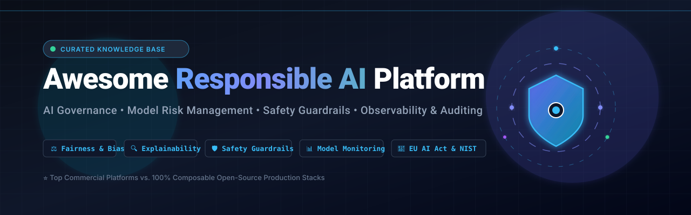
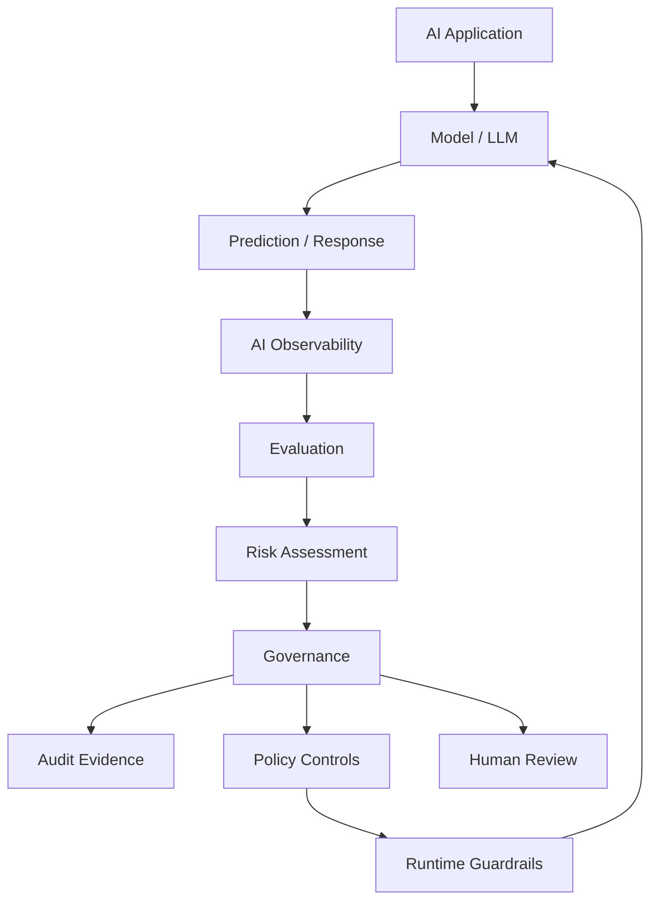
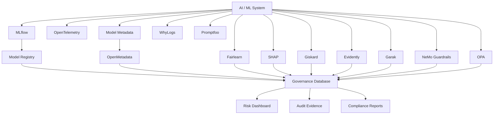
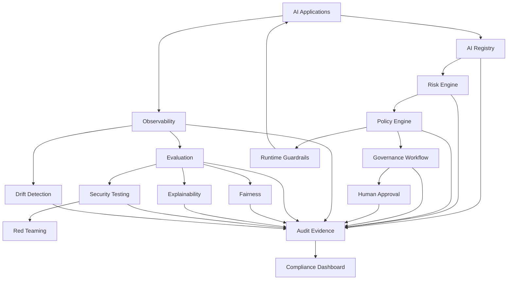

<div align="center">

<a href="https://github.com/ishandutta2007/Awesome-Responsible-AI-Platform">
  
</a>

<p align="center">
  <a href="https://github.com/ishandutta2007/Awesome-Awesome-Awesome"></a>
  <a href="https://discord.gg/jc4xtF58Ve"></a>
  <a href="https://github.com/ishandutta2007/Awesome-Responsible-AI-Platform/stargazers"></a>
  <a href="https://github.com/ishandutta2007/Awesome-Responsible-AI-Platform/network/members"></a>
  <a href="https://github.com/ishandutta2007/Awesome-Responsible-AI-Platform/blob/main/LICENSE"></a>
  <a href="https://github.com/ishandutta2007"></a>
</p>

# 🤖 Top Responsible AI Platforms & Open-Source AI Governance Stack 🛡️

**The definitive production guide to Responsible AI, Enterprise AI Governance, Model Risk Management (MRM), AI Compliance (EU AI Act, NIST AI RMF, ISO/IEC 42001), Bias & Fairness Auditing, Explainable AI (XAI), Runtime LLM Guardrails, AI Red Teaming, and Open-Source AI Safety Frameworks.**

</div>

> 🌐 A rigorously curated, enterprise-grade directory of **Responsible AI Platforms, Model Governance Engines, Observability Pipelines, and Open-Source AI Reliability Tools**.

---

### 🌟 Core Pillars of Responsible AI 🏛️

Responsible AI encompasses foundational practices, statistical tools, runtime safety architectures, and formal compliance processes ensuring AI and LLM systems are:

* ⚖️ **Fair & Unbiased** — Mitigating disparate impact, demographic disparity, and algorithmic harms across sensitive cohorts.
* 🔍 **Explainable & Interpretable** — Providing transparent local feature attributions (SHAP/LIME) and global model understanding.
* 👁️ **Transparent & Traceable** — Maintaining verifiable data provenance, open lineage graphs, and comprehensive model cards.
* 🏛️ **Accountable & Auditable** — Enabling tamper-evident risk logging, compliance registries, and deterministic audit trails.
* 🛡️ **Safe & Guarded** — Preventing prompt injections, jailbreaks, toxic completions, and unintended autonomous agent behaviors.
* 🦾 **Robust & Resilient** — Stress-testing against adversarial perturbations, distribution drift, and real-world edge cases.
* 🔐 **Privacy-Preserving** — Enforcing differential privacy, PII/PHI redaction, and strict data anonymization standards.
* 🔒 **Secure & Hardened** — Safeguarding AI model weights, training pipelines, and agent tool execution planes from exploit.
* 📜 **Regulatory Compliant** — Automating alignment with the EU AI Act, NIST AI RMF 1.0, ISO/IEC 42001, and NYC Local Law 144.
* 🧑‍🤝‍🧑 **Human-Centered** — Embedding human-in-the-loop (HITL) sign-offs, clear recourse mechanisms, and societal wellbeing.

---

The modern Responsible AI stack extends far beyond model fairness. It increasingly includes **AI inventories, risk classification, regulatory mapping, model documentation, evaluation, bias testing, explainability, monitoring, red-teaming, runtime guardrails, audit evidence and governance workflows**.

The commercial market is led by platforms such as **Microsoft Responsible AI, IBM watsonx.governance, Databricks AI Governance, Dataiku Govern, DataRobot, Credo AI, Holistic AI, Fiddler AI, and Arize AI**.

At the same time, there is a rapidly growing open-source ecosystem covering individual layers of the Responsible AI lifecycle.

> 💡 **Important:** There is currently no single open-source project that completely replaces an enterprise Responsible AI governance platform. A realistic open-source alternative is a **composable stack** combining fairness, explainability, evaluation, monitoring, documentation, security, testing and policy infrastructure.


---


## 📑 Table of Contents


* [☁️ SaaS/Hosted Platforms](#️-saashosted-platforms)

* [🌍 Open-Source](#-open-source)

* [⚖️ Open-Source Fairness & Bias Assessment](#️-open-source-fairness--bias-assessment)

* [🔍 Open-Source Explainable AI](#-open-source-explainable-ai)

* [🧪 Open-Source AI Evaluation & Testing](#-open-source-ai-evaluation--testing)

* [📊 Open-Source Model Monitoring](#-open-source-model-monitoring)

* [🛡️ Open-Source AI Safety & Guardrails](#️-open-source-ai-safety--guardrails)

* [🔴 Open-Source AI Red Teaming](#-open-source-ai-red-teaming)

* [📋 Open-Source Model Cards & Documentation](#-open-source-model-cards--documentation)

* [🗂️ Open-Source Model Registries & Governance](#️-open-source-model-registries--governance)

* [🔐 Open-Source Privacy & Responsible Data](#-open-source-privacy--responsible-data)

* [🔒 Open-Source AI Security](#-open-source-ai-security)

* [🧠 Open-Source LLM Evaluation](#-open-source-llm-evaluation)

* [🤖 Open-Source Agent Evaluation & Governance](#-open-source-agent-evaluation--governance)

* [🏗️ Open-Source MLOps & AI Lifecycle](#️-open-source-mlops--ai-lifecycle)

* [📜 Open-Source AI Policy & Compliance](#-open-source-ai-policy--compliance)

* [🧩 Commercial Platform → Open-Source Equivalent](#-commercial-platform--open-source-equivalent)

* [🏗️ Responsible AI Architecture](#️-responsible-ai-architecture)

* [🔄 Open-Source Responsible AI Architecture](#-open-source-responsible-ai-architecture)

* [🧪 Responsible AI Lifecycle](#-responsible-ai-lifecycle)

* [🛡️ AI Governance Control Plane](#️-ai-governance-control-plane)

* [⚖️ Commercial vs Open-Source](#️-commercial-vs-open-source)

* [🚀 Recommended Open-Source Stacks](#-recommended-open-source-stacks)

* [📊 Responsible AI Technology Comparison](#-responsible-ai-technology-comparison)

* [🎯 Recommended Projects by Use Case](#-recommended-projects-by-use-case)

* [🏢 Building a Credo AI Alternative](#-building-a-credo-ai-alternative)

* [🏛️ Building an Open-Source AI Governance Platform](#️-building-an-open-source-ai-governance-platform)

* [🌐 Open-Source Responsible AI Landscape](#-open-source-responsible-ai-landscape)

* [🧠 Why Open-Source Responsible AI Matters](#-why-open-source-responsible-ai-matters)

* [🤝 Contributing](#-contributing)

* [⚠️ Disclaimer](#️-disclaimer)


---


# ☁️ SaaS/Hosted Platforms


> **Market Size & Landscape Analysis:** The global AI Governance, Model Risk Management, and Responsible AI platform sector is estimated at **$350M–$500M in 2024–2025** and projected to surge past **$2.5B–$3.2B by 2030** (CAGR ~35–42%), driven by sweeping regulatory enforcement (EU AI Act, NIST AI RMF, ISO/IEC 42001, NYC Local Law 144). The market is currently **moderately to highly fragmented**—characterized by a competitive mix of hyperscale cloud ecosystems (Microsoft, IBM, Databricks), established enterprise data science platforms (DataRobot, Dataiku, SAS), security/GRC incumbents (OneTrust), and specialized pure-play Responsible AI & LLM observability innovators (Credo AI, Holistic AI, Fiddler AI, Arize). Rather than an early "winner-take-all" consolidation, enterprises currently adopt multi-layered, hybrid stacks bridging runtime guardrails, statistical evaluations, and executive compliance control planes.

| Platform | Company | Company Size / Valuation / Revenue | Primary Focus | Key Capabilities | Pricing | Free Tier Limits |
| --- | --- | --- | --- | --- | --- | --- |
| [Microsoft Responsible AI](https://www.microsoft.com/) | Microsoft | ~$3.1T Market Cap / $245B+ Annual Revenue | Responsible AI Tooling | Fairness, interpretability, error analysis and model assessment | Content Safety pay-as-you-go ($0.75/1K text records); Azure ML compute pay-per-second | F0 Free Tier: 5,000 text records + 5,000 image analyses/month (Azure Free Account: $200 credit for 30 days) |
| [IBM watsonx.governance](https://www.ibm.com/products/watsonx-governance) | IBM | ~$205B Market Cap / $62B+ Annual Revenue | Enterprise AI Governance | AI inventory, governance, risk, compliance, evaluation and lifecycle controls | Essentials starts at $0.60–$0.64/Resource Unit (R&C plans start at $3,500/month) | Lite plan free tier: max 200 Resource Units/month, 3 use cases, 1 inventory, 1,000 records/eval, 100 MB internal DB |
| [Truera](https://www.truera.com/) | TruEra / Snowflake | ~$55B Market Cap (Snowflake acquired TruEra in May 2024) | AI Quality & Explainability | Explainability, model quality, monitoring and AI evaluation | Acquired by Snowflake (incorporated into Snowflake AI Data Cloud pricing / usage credits) | Standalone SaaS retired; TruLens OSS framework is 100% free with unlimited local evaluations |
| [Databricks AI Governance](https://www.databricks.com/) | Databricks | ~$43B Valuation / $2.6B+ ARR | AI/Data Governance | Model governance, lineage, permissions, evaluation and monitoring | Standard Unity Catalog included; compute charged via DBUs starting at ~$0.07–$0.40/DBU | 14-day free trial with complimentary DBU credits across cloud providers; perpetual Databricks Free Edition for learning |
| [OneTrust AI Governance](https://www.onetrust.com/) | OneTrust | ~$4.5B Valuation / $400M+ ARR | AI Governance + GRC | AI discovery, risk, policy, compliance and privacy | Standalone AI Governance module starts at ~$50,000/year (Platform minimum ~$10,000/year) | No free tier or self-service trial; sales-assisted live sandbox and demo upon request |
| [SAS Responsible AI](https://www.sas.com/) | SAS | ~$3.2B Annual Revenue (Privately held) | Enterprise AI Governance | Model risk, fairness, explainability, monitoring and governance | SAS Viya subscription starts at ~$8,000–$10,000/year (varies by compute/user tier) | 14-day free trial of SAS Viya platform with full analytics and model deployment access |
| [DataRobot AI Governance](https://www.datarobot.com/) | DataRobot | ~$3.0B Valuation / ~$200M ARR | AI Governance | AI inventory, model governance, monitoring, compliance and risk management | Enterprise annual subscription (estimated starting at ~$65,000/year via AWS Marketplace/direct) | 30-day free trial of SaaS platform with core GenAI playground, RAG templates, and modeling workers |
| [Dataiku Govern](https://www.dataiku.com/) | Dataiku | ~$3.7B Valuation / ~$250M+ ARR | AI Lifecycle Governance | Model inventory, approvals, risk and deployment governance | Enterprise quote-based subscription | 14-day free trial of Dataiku Cloud; free self-installed Community/Discover edition for local desktop exploration |
| [Aporia](https://www.aporia.com/) | Aporia / Coralogix | ~$1.5B Valuation (Parent Coralogix acquired Aporia in 2024) | ML Observability | Monitoring, explainability, drift, bias and model performance | Custom usage-based pricing per model/predictions (now part of Coralogix) | Community Free plan: free monitoring for small-scale projects (up to ~10,000 predictions/month); 14-day free trial |
| [Arize AI](https://arize.com/) | Arize | ~$1.0B Valuation / $130M+ Total Funding | AI Observability | ML monitoring, LLM evaluation, tracing and model quality | AX Pro plan starts at $50/month ($10 per 1M additional spans, $3/GB) | AX Free tier: 25,000 trace spans/month, 1 GB ingestion/month, 15-day retention, unlimited users |
| [Fiddler AI](https://www.fiddler.ai/) | Fiddler AI | ~$300M Valuation / $55M+ Total Funding | AI Observability & Governance | Explainability, monitoring, fairness, LLM observability, governance and security | Developer plan starts at $0.002/trace (Enterprise custom quote) | Free plan includes Centor model real-time guardrails with <80ms latency (hallucination, toxicity, PII/PHI, prompt injection checks) |
| [Holistic AI](https://www.holisticai.com/) | Holistic AI | ~$150M Valuation / $20M+ Total Funding | Responsible AI Governance | AI auditing, bias, risk, compliance, monitoring and AI safety | Custom enterprise contract / Azure Marketplace private offer | No free tier or self-serve trial; access to free public AI Regulation Tracker hub and sales demo |
| [Credo AI](https://www.credo.ai/) | Credo AI | ~$120M Valuation / $43M+ Total Funding | AI Governance | AI inventory, risk assessment, policy packs, regulatory mapping, governance workflows | Starts at ~$30,000/year (Enterprise subscription based on use case volume) | No free tier or public self-serve trial; live product demos available upon request |
| [Credo AI Lens](https://www.credo.ai/) | Credo AI | ~$120M Valuation (Credo AI OSS project) | AI Assessment | Responsible AI assessment and evaluation tooling | 100% free (Open-source Python framework, archived on GitHub in July 2024) | Open-source framework under Apache 2.0: completely free with unlimited local execution |
| [Arthur AI](https://www.arthur.ai/) | Arthur | ~$100M Valuation / $60M+ Total Funding | AI Observability & Governance | Model monitoring, explainability, LLM evaluation and governance | Premium plan starts at $60/month (Enterprise custom quote) | Free tier ($0/month forever): up to 4 use cases, unlimited seats, core performance monitoring metrics |
| [ModelOp](https://www.modelop.com/) | ModelOp | ~$80M Valuation / $30M+ Total Funding | Model Governance | AI inventory, lifecycle management, policy and risk | Enterprise subscription based on model inventory volume | No free tier or public trial; custom enterprise proof-of-concept/demo available upon request |
| [FairNow / Optro](https://fairnow.ai/) | FairNow / Optro | ~$50M Valuation (Acquired by Optro in 2025) | AI Governance | AI inventory, model risk, regulatory compliance and governance | Enterprise contract (Acquired by Optro; estimated starting at ~$40,000/year) | No free tier or public free trial; scheduled product demos upon request |
| [WhyLabs](https://whylabs.ai/) | WhyLabs | ~$50M Valuation peak ($35M+ Total Raised; OSS in 2025) | AI Observability | Data quality, model monitoring, LLM monitoring and anomaly detection | Hosted SaaS discontinued in 2025; open-sourced under Apache 2.0 (Formerly Expert plan started at $125/month) | 100% free & open source under Apache 2.0 (Self-hosted whylabs, whylogs, and langkit with no usage limits) |
| [Monitaur](https://www.monitaur.ai/) | Monitaur | ~$40M Valuation / $15M+ Total Funding | AI Governance & Model Risk | Model governance, risk, controls, validation, monitoring and audit evidence | Custom enterprise subscription (quote-based per model/module) | No free tier or self-serve trial; guided demo available upon request |
| [Saidot](https://www.saidot.ai/) | Saidot | ~$25M Valuation / Seed funded (€2M+) | AI Governance | AI inventory, risk, regulatory compliance and governance workflows | Library & SME plans start at ~$1,638/month (Enterprise plans start at ~$3,627/month) | Free trial / guided pilot available upon request; live product demo via saidot.ai |


The commercial market increasingly splits into several categories: dedicated governance platforms such as Credo AI and Holistic AI, enterprise suites such as IBM watsonx.governance, observability-led platforms such as Fiddler and Arthur, and ML platforms with embedded governance.


---


# 🌍 Open-Source


The open-source Responsible AI ecosystem is best understood as a collection of complementary layers.


```text

                           RESPONSIBLE AI

                                  │

       ┌──────────────────────────┼──────────────────────────┐

       │                          │                          │

       ▼                          ▼                          ▼

   FAIRNESS                 EXPLAINABILITY              EVALUATION

       │                          │                          │

       ▼                          ▼                          ▼

   Fairlearn                  SHAP                      Giskard

   AIF360                     LIME                      DeepEval

   Aequitas                   InterpretML               LM Evaluation

       │                          │                          │

       └──────────────────────────┼──────────────────────────┘

                                  │

                                  ▼

                            MONITORING

                                  │

                    ┌─────────────┼─────────────┐

                    ▼             ▼             ▼

                Evidently      NannyML       WhyLogs

                    │

                    ▼

                         GOVERNANCE LAYER

                    │

             ┌──────┼──────┐

             ▼      ▼      ▼

          Registry Policy Audit

```


Unlike commercial governance suites, these projects typically specialize in one or more technical Responsible AI capabilities.


---


# ⚖️ Open-Source Fairness & Bias Assessment


Fairness is one of the foundational components of Responsible AI.


```text

Model

  │

  ▼

Predictions

  │

  ▼

Protected / Sensitive Attributes

  │

  ▼

Fairness Metrics

  │

  ├── Demographic Parity

  ├── Equal Opportunity

  ├── Equalized Odds

  ├── Disparate Impact

  └── Group Calibration

  │

  ▼

Mitigation

```


| Project | Stars | Primary Capability |
| --- | --- | --- |
| [InterpretML](https://github.com/interpretml/interpret) | [](https://github.com/interpretml/interpret/stargazers) | Glass-box modeling, fair algorithms, and interpretability |
| [Cleanlab](https://github.com/cleanlab/cleanlab) | [](https://github.com/cleanlab/cleanlab/stargazers) | Data-centric AI, finding label errors and dataset bias |
| [Fairlearn](https://github.com/fairlearn/fairlearn) | [](https://github.com/fairlearn/fairlearn/stargazers) | Fairness assessment and disparity mitigation |
| [AI Fairness 360](https://github.com/Trusted-AI/AIF360) | [](https://github.com/Trusted-AI/AIF360/stargazers) | Comprehensive algorithmic bias detection & mitigation toolkit |
| [What-If Tool](https://github.com/PAIR-code/what-if-tool) | [](https://github.com/PAIR-code/what-if-tool/stargazers) | Interactive model inspection and fairness probing |
| [Responsible AI Toolbox](https://github.com/microsoft/responsible-ai-toolbox) | [](https://github.com/microsoft/responsible-ai-toolbox/stargazers) | Integrated fairness, error analysis, and counterfactuals |
| [Aequitas](https://github.com/dssg/aequitas) | [](https://github.com/dssg/aequitas/stargazers) | Bias auditing and fairness reporting for public policy / data science |
| [TensorFlow Model Analysis](https://github.com/tensorflow/model-analysis) | [](https://github.com/tensorflow/model-analysis/stargazers) | Model evaluation, fairness indicators, and slicing at scale |
| [Themis-ML](https://github.com/cosmicBboy/themis-ml) | [](https://github.com/cosmicBboy/themis-ml/stargazers) | Fairness-aware machine learning library |


Fairlearn provides assessment and mitigation capabilities with a scikit-learn-style API, while AIF360 provides a broader collection of fairness metrics and mitigation algorithms.


---


# 🔍 Open-Source Explainable AI


Explainability helps answer:


> **Why did the model make this prediction?**


| Project | Stars | Approach |
| --- | --- | --- |
| [SHAP](https://github.com/shap/shap) | [](https://github.com/shap/shap/stargazers) | Game-theoretic Shapley additive explanations for complex models |
| [LIME](https://github.com/marcotcr/lime) | [](https://github.com/marcotcr/lime/stargazers) | Local Interpretable Model-agnostic Explanations |
| [InterpretML](https://github.com/interpretml/interpret) | [](https://github.com/interpretml/interpret/stargazers) | Glass-box Explainable Boosting Machines (EBM) and black-box wrappers |
| [Captum](https://github.com/pytorch/captum) | [](https://github.com/pytorch/captum/stargazers) | PyTorch gradient-based interpretability and attribution library |
| [ELI5](https://github.com/TeamHG-Memex/eli5) | [](https://github.com/TeamHG-Memex/eli5/stargazers) | Model inspection, feature weight visualization, and debugging |
| [What-If Tool](https://github.com/PAIR-code/what-if-tool) | [](https://github.com/PAIR-code/what-if-tool/stargazers) | Interactive visual probing of ML models |
| [Alibi Explain](https://github.com/SeldonIO/alibi) | [](https://github.com/SeldonIO/alibi/stargazers) | Black-box explainability, counterfactual instances, and anchors |
| [OmniXAI](https://github.com/salesforce/OmniXAI) | [](https://github.com/salesforce/OmniXAI/stargazers) | Comprehensive XAI toolkit for tabular, vision, NLP, and time-series data |


A Responsible AI platform can use these tools as the **explainability engine** underneath a governance layer.


---


# 🧪 Open-Source AI Evaluation & Testing


Responsible AI requires systematic testing before and after deployment.


| Project | Stars | Focus |
| --- | --- | --- |
| [MLflow](https://github.com/mlflow/mlflow) | [](https://github.com/mlflow/mlflow/stargazers) | Complete ML lifecycle, model evaluation, and GenAI experiment tracking |
| [OpenAI Evals](https://github.com/openai/evals) | [](https://github.com/openai/evals/stargazers) | Framework for evaluating LLMs and LLM-powered applications |
| [Ragas](https://github.com/explodinggradients/ragas) | [](https://github.com/explodinggradients/ragas/stargazers) | Evaluation framework for Retrieval Augmented Generation (RAG) pipelines |
| [EleutherAI LM Evaluation Harness](https://github.com/EleutherAI/lm-evaluation-harness) | [](https://github.com/EleutherAI/lm-evaluation-harness/stargazers) | De-facto standard framework for few-shot evaluation of language models |
| [DeepEval](https://github.com/confident-ai/deepeval) | [](https://github.com/confident-ai/deepeval/stargazers) | Production-grade LLM evaluation framework with unit-testing paradigms |
| [Giskard](https://github.com/Giskard-AI/giskard) | [](https://github.com/Giskard-AI/giskard/stargazers) | AI testing for hallucination, prompt injection, bias, and regressions |
| [Deepchecks](https://github.com/deepchecks/deepchecks) | [](https://github.com/deepchecks/deepchecks/stargazers) | Holistic ML test suites for data integrity, drift, and performance validation |
| [HELM](https://github.com/stanford-crfm/helm) | [](https://github.com/stanford-crfm/helm/stargazers) | Holistic Evaluation of Language Models across accuracy, bias, and toxicity |
| [TruLens](https://github.com/truera/trulens) | [](https://github.com/truera/trulens/stargazers) | Evaluation and observability for LLM apps using the RAG triad |
| [Inspect AI](https://github.com/UKGovernmentBEIS/inspect_ai) | [](https://github.com/UKGovernmentBEIS/inspect_ai/stargazers) | UK AI Safety Institute standard framework for frontier model capabilities & safety |


Giskard describes itself as an open-source framework for detecting performance, bias and security issues across traditional ML systems and LLM applications.


---


# 📊 Open-Source Model Monitoring


Responsible AI does not stop at deployment.


```text

                MODEL DEPLOYMENT

                       │

                       ▼

                  Production

                       │

             ┌─────────┼─────────┐

             ▼         ▼         ▼

           Drift     Bias     Quality

             │         │         │

             └─────────┼─────────┘

                       ▼

                  Risk Alerts

                       │

                       ▼

                  Governance

```


| Project | Stars | Primary Focus |
| --- | --- | --- |
| [Prometheus](https://github.com/prometheus/prometheus) | [](https://github.com/prometheus/prometheus/stargazers) | Industry-standard cloud-native time-series monitoring and alerting |
| [MLflow](https://github.com/mlflow/mlflow) | [](https://github.com/mlflow/mlflow/stargazers) | Model tracking, deployment registry, and production observability |
| [Evidently](https://github.com/evidentlyai/evidently) | [](https://github.com/evidentlyai/evidently/stargazers) | Evaluation, drift detection, and observability for tabular data and LLMs |
| [Great Expectations](https://github.com/great-expectations/great_expectations) | [](https://github.com/great-expectations/great_expectations/stargazers) | Automated data testing, profiling, and quality pipeline enforcement |
| [OpenTelemetry](https://github.com/open-telemetry/opentelemetry-collector) | [](https://github.com/open-telemetry/opentelemetry-collector/stargazers) | Vendor-neutral distributed telemetry, spans, and metrics collection |
| [Deepchecks](https://github.com/deepchecks/deepchecks) | [](https://github.com/deepchecks/deepchecks/stargazers) | Continuous ML validation, production data drift, and performance monitoring |
| [WhyLogs](https://github.com/whylabs/whylogs) | [](https://github.com/whylabs/whylogs/stargazers) | Lightweight, mergeable statistical data profiling for ML and GenAI |
| [NannyML](https://github.com/NannyML/nannyml) | [](https://github.com/NannyML/nannyml/stargazers) | Post-deployment performance estimation without ground-truth labels and drift detection |


---


# 🛡️ Open-Source AI Safety & Guardrails

Responsible AI increasingly includes runtime controls.

```text
                    AI REQUEST
                        │
                        ▼
                   Guardrails
                        │
           ┌────────────┼────────────┐
           ▼            ▼            ▼
       Safety        Privacy       Policy
        Check         Check         Check
           │            │            │
           └────────────┼────────────┘
                        ▼
                      Model
                        │
                        ▼
                    Response
                        │
                        ▼
                   Output Check
```

| Project | Stars | Focus |
| --- | --- | --- |
| [LiteLLM](https://github.com/BerriAI/litellm) | [](https://github.com/BerriAI/litellm/stargazers) | Unified LLM API gateway with spend controls, fallbacks, and guardrail routing |
| [Open Policy Agent](https://github.com/open-policy-agent/opa) | [](https://github.com/open-policy-agent/opa/stargazers) | General-purpose declarative policy engine for governance and authorization |
| [Guardrails AI](https://github.com/guardrails-ai/guardrails) | [](https://github.com/guardrails-ai/guardrails/stargazers) | Input/output validation, structured outputs, and guardrail hub validators |
| [NeMo Guardrails](https://github.com/NVIDIA-NeMo/Guardrails) | [](https://github.com/NVIDIA-NeMo/Guardrails/stargazers) | NVIDIA programmable rails for topical, safety, and agent dialogue security |
| [Presidio](https://github.com/microsoft/presidio) | [](https://github.com/microsoft/presidio/stargazers) | Production-grade PII detection, redaction, and anonymization |
| [LLM Guard](https://github.com/protectai/llm-guard) | [](https://github.com/protectai/llm-guard/stargazers) | Comprehensive security toolkit for LLM prompts, toxicity, and sanitization |
| [Llama Guard (PurpleLlama)](https://github.com/meta-llama/PurpleLlama) | [](https://github.com/meta-llama/PurpleLlama/stargazers) | Meta open foundation models for human-AI safety and input/output classification |
| [Rebuff](https://github.com/protectai/rebuff) | [](https://github.com/protectai/rebuff/stargazers) | Multi-layered defense prompt-injection detection framework |


---


# 🔴 Open-Source AI Red Teaming

Responsible AI programs increasingly require adversarial testing.

| Project | Stars | Focus |
| --- | --- | --- |
| [Promptfoo](https://github.com/promptfoo/promptfoo) | [](https://github.com/promptfoo/promptfoo/stargazers) | CLI & library for LLM security auditing, jailbreak probes, and red teaming |
| [Giskard](https://github.com/Giskard-AI/giskard) | [ | Automated red teaming for LLMs, prompt leak, and sycophancy testing |
| [PurpleLlama](https://github.com/meta-llama/PurpleLlama) | [](https://github.com/meta-llama/PurpleLlama/stargazers) | Meta AI suite of safety evaluation benchmarks and cyber security tools |
| [Garak](https://github.com/NVIDIA/garak) | [](https://github.com/NVIDIA/garak/stargazers) | LLM vulnerability scanner (hallucination, jailbreak, data leakage probing) |
| [PyRIT](https://github.com/Azure/PyRIT) | [](https://github.com/Azure/PyRIT/stargazers) | Microsoft Python Risk Identification Toolkit for proactive generative AI red teaming |
| [Inspect AI](https://github.com/UKGovernmentBEIS/inspect_ai) | [](https://github.com/UKGovernmentBEIS/inspect_ai/stargazers) | UK AI Safety Institute evaluation engine for hazardous capabilities |
| [Fiddler Auditor](https://github.com/fiddler-labs/fiddler-auditor) | [](https://github.com/fiddler-labs/fiddler-auditor/stargazers) | Open-source robustness and perturbation testing library for LLMs |


Fiddler has described Fiddler Auditor as an open-source robustness library for red-teaming LLMs.


---


# 📋 Open-Source Model Cards & Documentation

Transparency is a core Responsible AI requirement.

| Project | Stars | Capability |
| --- | --- | --- |
| [MLflow](https://github.com/mlflow/mlflow) | [](https://github.com/mlflow/mlflow/stargazers) | Model registry, metadata tracking, and governance artifact storage |
| [DVC](https://github.com/iterative/dvc) | [](https://github.com/iterative/dvc/stargazers) | Git-based data and model versioning with reproducible ML pipelines |
| [OpenLineage](https://github.com/OpenLineage/OpenLineage) | [](https://github.com/OpenLineage/OpenLineage/stargazers) | Open standard for end-to-end data and pipeline lineage tracking |
| [Marquez](https://github.com/MarquezProject/marquez) | [](https://github.com/MarquezProject/marquez/stargazers) | Reference implementation for OpenLineage metadata collection & lineage graphs |
| [Model Card Toolkit](https://github.com/tensorflow/model-card-toolkit) | [](https://github.com/tensorflow/model-card-toolkit/stargazers) | Automated generation of structured Responsible AI model cards |
| [Hugging Face Model Cards](https://huggingface.co/docs/hub/model-cards) | [](https://huggingface.co/docs/hub/model-cards) | Standardized community model documentation and intended-use specifications |
| [Datasheets for Datasets](https://www.microsoft.com/en-us/research/project/datasheets-for-datasets/) | [](https://www.microsoft.com/en-us/research/project/datasheets-for-datasets/) | Landmark foundational methodology for dataset transparency and provenance documentation |


---


# 🗂️ Open-Source Model Registries & Governance

A governance platform needs a system of record for AI systems.

| Project | Stars | Role |
| --- | --- | --- |
| [MLflow](https://github.com/mlflow/mlflow) | [](https://github.com/mlflow/mlflow/stargazers) | Centralized model registry, versioning, deployment stages, and metadata |
| [Kubeflow](https://github.com/kubeflow/kubeflow) | [](https://github.com/kubeflow/kubeflow/stargazers) | Kubernetes-native cloud ML platform and pipeline orchestrator |
| [DVC](https://github.com/iterative/dvc) | [](https://github.com/iterative/dvc/stargazers) | Data and model version control with pipeline provenance tracking |
| [DataHub](https://github.com/datahub-project/datahub) | [](https://github.com/datahub-project/datahub/stargazers) | Enterprise data and AI catalog with governance and lineage capabilities |
| [OpenMetadata](https://github.com/open-metadata/OpenMetadata) | [](https://github.com/open-metadata/OpenMetadata/stargazers) | Unified metadata management, data governance, and automated lineage |
| [Feast](https://github.com/feast-dev/feast) | [](https://github.com/feast-dev/feast/stargazers) | Production feature store managing consistent point-in-time features |
| [Amundsen](https://github.com/amundsen-io/amundsen) | [](https://github.com/amundsen-io/amundsen/stargazers) | Data discovery and metadata engine |
| [OpenLineage](https://github.com/OpenLineage/OpenLineage) | [](https://github.com/OpenLineage/OpenLineage/stargazers) | Open standard framework for operational data lineage collection |
| [Marquez](https://github.com/MarquezProject/marquez) | [](https://github.com/MarquezProject/marquez/stargazers) | Modular metadata service for pipeline health and lineage graphing |


A governance application can build an **AI registry on top of these metadata and lifecycle systems**.


---


# 🔐 Open-Source Privacy & Responsible Data

Responsible AI requires responsible handling of training and inference data.

| Project | Stars | Capability |
| --- | --- | --- |
| [Faker](https://github.com/joke2k/faker) | [](https://github.com/joke2k/faker/stargazers) | Widely used realistic fake data generator for testing and privacy |
| [Microsoft Presidio](https://github.com/microsoft/presidio) | [](https://github.com/microsoft/presidio/stargazers) | Context-aware PII detection, redaction, and de-identification framework |
| [SDV (Synthetic Data Vault)](https://github.com/sdv-dev/SDV) | [](https://github.com/sdv-dev/SDV/stargazers) | Generative models for realistic synthetic tabular and relational datasets |
| [Opacus](https://github.com/pytorch/opacus) | [](https://github.com/pytorch/opacus/stargazers) | High-speed differential privacy training for PyTorch models |
| [TensorFlow Privacy](https://github.com/tensorflow/privacy) | [](https://github.com/tensorflow/privacy/stargazers) | Library for training ML models with differential privacy guarantees |
| [OpenDP](https://github.com/opendp/opendp) | [](https://github.com/opendp/opendp/stargazers) | Mathematical differential privacy computation library |
| [ARX De-Identifier](https://github.com/arx-deidentifier/arx) | [](https://github.com/arx-deidentifier/arx/stargazers) | Comprehensive data anonymization tool implementing k-anonymity, l-diversity |
| [SmartNoise](https://github.com/opendp/smartnoise-sdk) | [](https://github.com/opendp/smartnoise-sdk/stargazers) | Differential privacy platform and SDK for tabular data querying |
| [DataSynthesizer](https://github.com/DataResponsibly/DataSynthesizer) | [](https://github.com/DataResponsibly/DataSynthesizer/stargazers) | Privacy-preserving synthetic dataset generation tool |


---


# 🔒 Open-Source AI Security

Responsible AI overlaps significantly with AI security.

| Project | Stars | Focus |
| --- | --- | --- |
| [Open Policy Agent](https://github.com/open-policy-agent/opa) | [](https://github.com/open-policy-agent/opa/stargazers) | General-purpose policy engine for cloud-native AI authorization & guardrails |
| [Promptfoo](https://github.com/promptfoo/promptfoo) | [](https://github.com/promptfoo/promptfoo/stargazers) | Security evaluation, prompt injection, and red teaming test suites |
| [Guardrails AI](https://github.com/guardrails-ai/guardrails) | [](https://github.com/guardrails-ai/guardrails/stargazers) | Runtime output safety, structured validation, and hallucination prevention |
| [Adversarial Robustness Toolbox (ART)](https://github.com/Trusted-AI/adversarial-robustness-toolbox) | [](https://github.com/Trusted-AI/adversarial-robustness-toolbox/stargazers) | Python library for ML security against evasion, poisoning, and extraction attacks |
| [NeMo Guardrails](https://github.com/NVIDIA-NeMo/Guardrails) | [](https://github.com/NVIDIA-NeMo/Guardrails/stargazers) | Programmable rails for conversational AI safety and dialogue controls |
| [Presidio](https://github.com/microsoft/presidio) | [](https://github.com/microsoft/presidio/stargazers) | Sensitive data and PII protection layer across LLM pipelines |
| [LLM Guard](https://github.com/protectai/llm-guard) | [](https://github.com/protectai/llm-guard/stargazers) | The security toolkit for LLM interactions (sanitization, injection, toxicity) |
| [Garak](https://github.com/NVIDIA/garak) | [](https://github.com/NVIDIA/garak/stargazers) | LLM vulnerability scanner across 50+ adversarial attack classes |
| [PyRIT](https://github.com/Azure/PyRIT) | [](https://github.com/Azure/PyRIT/stargazers) | Python Risk Identification Toolkit for automated AI red teaming |
| [Rebuff](https://github.com/protectai/rebuff) | [](https://github.com/protectai/rebuff/stargazers) | Prompt injection detector utilizing heuristics, vector DBs, and LLM checks |


---


# 🧠 Open-Source LLM Evaluation

Responsible AI for generative AI requires additional evaluation dimensions.

```text
                       LLM
                        │
       ┌────────────────┼────────────────┐
       ▼                ▼                ▼
   Accuracy          Safety          Fairness
       │                │                │
       ▼                ▼                ▼
  Hallucination     Toxicity        Bias
       │                │                │
       └────────────────┼────────────────┘
                        ▼
                  Governance Score
```

| Project | Stars | Evaluation |
| --- | --- | --- |
| [MLflow](https://github.com/mlflow/mlflow) | [](https://github.com/mlflow/mlflow/stargazers) | GenAI experiment tracking, automated evaluation metrics, and model registry |
| [OpenAI Evals](https://github.com/openai/evals) | [](https://github.com/openai/evals/stargazers) | Benchmark evaluation framework for frontier LLMs and custom datasets |
| [Ragas](https://github.com/explodinggradients/ragas) | [](https://github.com/explodinggradients/ragas/stargazers) | Rigorous RAG evaluation (faithfulness, answer relevance, context precision) |
| [EleutherAI LM Evaluation Harness](https://github.com/EleutherAI/lm-evaluation-harness) | [](https://github.com/EleutherAI/lm-evaluation-harness/stargazers) | Standardized benchmarking harness covering 60+ standard academic tasks |
| [Promptfoo](https://github.com/promptfoo/promptfoo) | [](https://github.com/promptfoo/promptfoo/stargazers) | CI/CD testing, prompt tuning, regression detection, and adversarial evaluation |
| [DeepEval](https://github.com/confident-ai/deepeval) | [](https://github.com/confident-ai/deepeval/stargazers) | Pytest-like unit testing for LLM apps (G-Eval, hallucination, toxicity) |
| [Giskard](https://github.com/Giskard-AI/giskard) | [ | Automated scanning for LLM vulnerabilities, hallucination, and bias |
| [HELM](https://github.com/stanford-crfm/helm) | [](https://github.com/stanford-crfm/helm/stargazers) | Stanford Holistic Evaluation of Language Models across transparency & robustness |
| [TruLens](https://github.com/truera/trulens) | [](https://github.com/truera/trulens/stargazers) | Instrumentation, feedback functions, and RAG triad evaluation |
| [Inspect AI](https://github.com/UKGovernmentBEIS/inspect_ai) | [](https://github.com/UKGovernmentBEIS/inspect_ai/stargazers) | Safety evaluation platform built by the UK AI Safety Institute |


---


# 🤖 Open-Source Agent Evaluation & Governance

Agentic AI introduces additional governance dimensions:

```text
             AI AGENT
                │
       ┌────────┼────────┐
       ▼        ▼        ▼
     Model     Tools    Data
       │        │        │
       └────────┼────────┘
                ▼
             Actions
                │
       ┌────────┼────────┐
       ▼        ▼        ▼
   Identity   Policy   Audit
```

| Project | Stars | Capability |
| --- | --- | --- |
| [Open Policy Agent](https://github.com/open-policy-agent/opa) | [](https://github.com/open-policy-agent/opa/stargazers) | Declarative policy enforcement for agent tools, sandboxes, and execution rights |
| [Langfuse](https://github.com/langfuse/langfuse) | [](https://github.com/langfuse/langfuse/stargazers) | Open-source LLM engineering platform: detailed agent tracing, evals, and prompt management |
| [Arize Phoenix](https://github.com/Arize-ai/phoenix) | [](https://github.com/Arize-ai/phoenix/stargazers) | AI observability and evaluation for LLM agents, tracing spans, and RAG analytics |
| [Promptfoo](https://github.com/promptfoo/promptfoo) | [](https://github.com/promptfoo/promptfoo/stargazers) | Agent workflow security testing, tool-call validation, and red teaming |
| [DeepEval](https://github.com/confident-ai/deepeval) | [](https://github.com/confident-ai/deepeval/stargazers) | Multi-step agent trajectory testing, task completion, and tool selection metrics |
| [NeMo Guardrails](https://github.com/NVIDIA-NeMo/Guardrails) | [](https://github.com/NVIDIA-NeMo/Guardrails/stargazers) | Conversational rails, function-call boundaries, and agent state control |
| [Giskard](https://github.com/Giskard-AI/giskard) | [ | Agent testing framework for automated vulnerability and goal hijacking scanning |
| [OpenTelemetry](https://github.com/open-telemetry/opentelemetry-collector) | [](https://github.com/open-telemetry/opentelemetry-collector/stargazers) | Standardized telemetry pipeline for agent distributed execution traces and spans |
| [Inspect AI](https://github.com/UKGovernmentBEIS/inspect_ai) | [](https://github.com/UKGovernmentBEIS/inspect_ai/stargazers) | Evaluation framework for autonomous agent capabilities, cyber capabilities, and protocols |


---


# 🏗️ Open-Source MLOps & AI Lifecycle

Responsible AI should be integrated directly into the ML lifecycle.

| Project | Stars | Role |
| --- | --- | --- |
| [MLflow](https://github.com/mlflow/mlflow) | [](https://github.com/mlflow/mlflow/stargazers) | Unified open-source platform for the full machine learning lifecycle |
| [Kubeflow](https://github.com/kubeflow/kubeflow) | [](https://github.com/kubeflow/kubeflow/stargazers) | Dedicated Kubernetes-native ML toolkit for scalable training and serving |
| [DVC](https://github.com/iterative/dvc) | [](https://github.com/iterative/dvc/stargazers) | Version control system for machine learning projects, data, and models |
| [Metaflow](https://github.com/Netflix/metaflow) | [](https://github.com/Netflix/metaflow/stargazers) | Netflix-developed human-friendly Python framework for data science and ML |
| [BentoML](https://github.com/bentoml/BentoML) | [](https://github.com/bentoml/BentoML/stargazers) | High-performance unified framework for serving, packaging, and deploying ML/GenAI |
| [Flyte](https://github.com/flyteorg/flyte) | [](https://github.com/flyteorg/flyte/stargazers) | Highly scalable orchestrator for data and ML workflows built on Kubernetes |
| [Feast](https://github.com/feast-dev/feast) | [](https://github.com/feast-dev/feast/stargazers) | Production-ready open-source feature store for machine learning |
| [ZenML](https://github.com/zenml-io/zenml) | [](https://github.com/zenml-io/zenml/stargazers) | Extensible MLOps framework to build reproducible production ML pipelines |
| [KServe](https://github.com/kserve/kserve) | [](https://github.com/kserve/kserve/stargazers) | Standardized, highly scalable model inference platform for Kubernetes |
| [Seldon Core](https://github.com/SeldonIO/seldon-core) | [](https://github.com/SeldonIO/seldon-core/stargazers) | Cloud-native MLOps orchestration for deployment, scaling, and governance |


---


# 📜 Open-Source AI Policy & Compliance


Responsible AI governance requires translating principles and regulations into operational controls.


Important frameworks include:


| Framework                          | Focus                                 |

| ---------------------------------- | ------------------------------------- |

| **NIST AI RMF**                    | AI risk management                    |

| **NIST GenAI Profile**             | Generative AI risk                    |

| **ISO/IEC 42001**                  | AI management systems                 |

| **ISO/IEC 23894**                  | AI risk management                    |

| **EU AI Act**                      | AI regulation                         |

| **OECD AI Principles**             | Responsible AI                        |

| **IEEE 7000 Series**               | Ethical AI / technology governance    |

| **NYC Local Law 144**              | Automated employment decision tools   |

| **GDPR**                           | Privacy and automated decision-making |

| **Model Risk Management Guidance** | Financial-services model risk         |


A practical open-source governance implementation can map these frameworks into:


```text

Framework

    │

    ▼

Control

    │

    ▼

Requirement

    │

    ▼

Evidence

    │

    ▼

Assessment

    │

    ▼

Risk

    │

    ▼

Remediation

    │

    ▼

Audit

```


---


# 🧩 Commercial Platform → Open-Source Equivalent


| Commercial Platform                    | Open-Source Equivalent / Building Blocks                                 |

| -------------------------------------- | ------------------------------------------------------------------------ |

| **Credo AI**                           | OpenMetadata + MLflow + Fairlearn + Giskard + Evidently + OPA            |

| **Holistic AI**                        | Fairlearn + AIF360 + Giskard + Garak + Evidently + MLflow                |

| **FairNow / Optro**                    | OpenMetadata + MLflow + Fairlearn + OPA + compliance workflows           |

| **Monitaur**                           | MLflow + OpenMetadata + Fairlearn + Evidently + Giskard + audit database |

| **Truera**                             | SHAP + LIME + InterpretML + Evidently + TruLens                          |

| **Fiddler AI**                         | Evidently + WhyLogs + SHAP + TruLens + OpenTelemetry + Guardrails        |

| **SAS Responsible AI**                 | MLflow + Fairlearn + SHAP + Evidently + Open Policy Agent                |

| **IBM watsonx.governance**             | MLflow + OpenMetadata + Evidently + Giskard + OPA + workflow engine      |

| **Microsoft Responsible AI Dashboard** | Fairlearn + Responsible AI Toolbox + InterpretML + SHAP                  |

| **DataRobot AI Governance**            | MLflow + OpenMetadata + Evidently + Fairlearn + workflow engine          |

| **Arthur AI**                          | Evidently + WhyLogs + TruLens + OpenTelemetry                            |

| **ModelOp**                            | MLflow + OpenMetadata + OPA + workflow engine                            |

| **Aporia**                             | Evidently + WhyLogs + Prometheus + Grafana                               |

| **WhyLabs**                            | WhyLogs + Evidently + Prometheus + Grafana                               |

| **Arize AI**                           | Phoenix + OpenTelemetry + Evidently + TruLens                            |

| **OneTrust AI Governance**             | OpenMetadata + OPA + policy database + workflow engine                   |

| **Enterprise Responsible AI Platform** | MLflow + OpenMetadata + Fairlearn + Giskard + Evidently + OPA            |


> These mappings are **architectural equivalents**, not drop-in replacements. Commercial platforms combine software, integrations, governance workflows, regulatory content, enterprise support and professional services that require substantial additional engineering to reproduce.


---


# 🏗️ Responsible AI Architecture





---


# 🔄 Open-Source Responsible AI Architecture





---


# 🧪 Responsible AI Lifecycle


A complete Responsible AI lifecycle can be implemented as:


```text

 id="raif9x"

                     AI IDEA

                       │

                       ▼

                ┌──────────────┐

                │ AI Inventory │

                └──────┬───────┘

                       │

                       ▼

                  Risk Scoring

                       │

                       ▼

                 Data Assessment

                       │

                       ▼

                Fairness Testing

                       │

                       ▼

                 Explainability

                       │

                       ▼

                  Safety Testing

                       │

                       ▼

                  Red Teaming

                       │

                       ▼

                 Human Review

                       │

                       ▼

                   Approval

                       │

                       ▼

                  Deployment

                       │

                       ▼

                 Monitoring

                       │

                       ▼

              Drift / Bias / Risk

                       │

                       ▼

                  Reassessment

                       │

                       ▼

                      Audit

```


---


# 🛡️ AI Governance Control Plane


A modern Responsible AI platform can be thought of as a control plane sitting above technical AI infrastructure.


```text

                  AI GOVERNANCE CONTROL PLANE

        ┌─────────────────────────────────────────┐

        │                                         │

        │  Inventory                              │

        │  Risk Assessment                        │

        │  Policies                               │

        │  Regulatory Mapping                     │

        │  Model Documentation                    │

        │  Evaluation                             │

        │  Audit Evidence                         │

        │  Human Approval                         │

        │                                         │

        └──────────────────┬──────────────────────┘

                           │

              ┌────────────┼────────────┐

              ▼            ▼            ▼

           ML Models      LLMs        Agents

              │            │            │

              ▼            ▼            ▼

          Production   Production   Production

```


---


# 🔍 AI Governance vs AI Observability vs AI Safety


These categories are frequently conflated.


| Layer                  | Main Question                                    |

| ---------------------- | ------------------------------------------------ |

| **AI Governance**      | Should we deploy and operate this AI system?     |

| **AI Risk Management** | What could go wrong and how serious is it?       |

| **AI Evaluation**      | Does the system behave as expected?              |

| **AI Observability**   | What is happening in production?                 |

| **AI Explainability**  | Why did the system make this decision?           |

| **AI Fairness**        | Does the system behave equitably across groups?  |

| **AI Safety**          | Can the system cause harmful outcomes?           |

| **AI Security**        | Can the system be attacked or manipulated?       |

| **AI Guardrails**      | Can unsafe behavior be prevented at runtime?     |

| **AI Compliance**      | Can we demonstrate compliance with requirements? |

| **AI Audit**           | Can we prove that controls operated effectively? |


A mature Responsible AI architecture usually needs **all of these layers**, rather than treating governance as a single dashboard.


---


# ⚖️ Commercial vs Open-Source


| Capability               | Commercial Responsible AI | Open-Source Stack              |

| ------------------------ | ------------------------- | ------------------------------ |

| AI Inventory             | ✅                         | Build                          |

| Model Registry           | ✅                         | ✅                              |

| Risk Assessment          | ✅                         | Build                          |

| Policy Management        | ✅                         | Build                          |

| Regulatory Mapping       | ✅                         | Build / Integrate              |

| Fairness                 | ✅                         | ✅                              |

| Explainability           | ✅                         | ✅                              |

| Model Monitoring         | ✅                         | ✅                              |

| LLM Evaluation           | ✅                         | ✅                              |

| Red Teaming              | ✅                         | ✅                              |

| AI Security              | ✅                         | ✅                              |

| Guardrails               | ✅                         | ✅                              |

| Model Cards              | ✅                         | ✅                              |

| Audit Evidence           | ✅                         | Build                          |

| Workflow                 | ✅                         | Build                          |

| Human Approval           | ✅                         | Build                          |

| Vendor AI Governance     | ✅                         | Build                          |

| Third-Party AI Inventory | ✅                         | Build                          |

| Agent Governance         | Increasingly              | Build                          |

| Runtime Enforcement      | Increasingly              | ✅ Building Blocks              |

| Data Ownership           | Vendor-dependent          | Full control                   |

| Source Code              | Usually proprietary       | ✅                              |

| Self Hosting             | Varies                    | ✅                              |

| Air-Gapped               | Enterprise-dependent      | ✅                              |

| Customization            | Medium                    | Very High                      |

| Vendor Lock-In           | Higher                    | Lower                          |

| Time to Deploy           | Faster                    | Slower                         |

| Engineering Required     | Lower                     | Higher                         |

| Regulatory Expertise     | Often Included            | Must Build                     |

| Support                  | Vendor                    | Community / Commercial support |

| Cost Model               | Subscription              | Infrastructure + engineering   |


---


# 📊 Responsible AI Technology Comparison


| Project                | Fairness | Explainability | Evaluation | Monitoring | Security | Governance |

| ---------------------- | :------: | :------------: | :--------: | :--------: | :------: | :--------: |

| Fairlearn              |     ✅    |        ❌       |     ⚠️     |      ❌     |     ❌    |     ⚠️     |

| AIF360                 |     ✅    |        ❌       |      ✅     |      ❌     |     ❌    |     ⚠️     |

| Aequitas               |     ✅    |        ❌       |      ✅     |      ❌     |     ❌    |     ⚠️     |

| SHAP                   |     ❌    |        ✅       |     ⚠️     |      ❌     |     ❌    |      ❌     |

| LIME                   |     ❌    |        ✅       |     ⚠️     |      ❌     |     ❌    |      ❌     |

| InterpretML            |     ✅    |        ✅       |      ✅     |      ❌     |     ❌    |     ⚠️     |

| Giskard                |     ✅    |       ⚠️       |      ✅     |     ⚠️     |     ✅    |     ⚠️     |

| Evidently              |    ⚠️    |        ❌       |      ✅     |      ✅     |     ❌    |     ⚠️     |

| NannyML                |    ⚠️    |        ❌       |      ✅     |      ✅     |     ❌    |      ❌     |

| WhyLogs                |     ❌    |        ❌       |     ⚠️     |      ✅     |     ❌    |      ❌     |

| TruLens                |     ❌    |       ⚠️       |      ✅     |      ✅     |     ❌    |     ⚠️     |

| Garak                  |     ❌    |        ❌       |     ⚠️     |      ❌     |     ✅    |      ❌     |

| PyRIT                  |     ❌    |        ❌       |      ✅     |      ❌     |     ✅    |      ❌     |

| Promptfoo              |    ⚠️    |        ❌       |      ✅     |     ⚠️     |     ✅    |     ⚠️     |

| NeMo Guardrails        |     ❌    |        ❌       |     ⚠️     |     ⚠️     |     ✅    |      ✅     |

| OPA                    |     ❌    |        ❌       |      ❌     |      ❌     |     ✅    |      ✅     |

| MLflow                 |     ❌    |        ❌       |      ✅     |     ⚠️     |    ⚠️    |      ✅     |

| OpenMetadata           |     ❌    |        ❌       |      ❌     |      ❌     |    ⚠️    |      ✅     |

| Responsible AI Toolbox |     ✅    |        ✅       |      ✅     |     ⚠️     |     ❌    |     ⚠️     |


---


# 🚀 Recommended Open-Source Stacks


## 🏆 1. General Responsible AI


```text

MLflow

+

OpenMetadata

+

Fairlearn

+

SHAP

+

Giskard

+

Evidently

+

OPA

```


Best general starting point for a self-hosted Responsible AI program.


---


## ⚖️ 2. Fairness-First Stack


```text

Fairlearn

+

AIF360

+

Aequitas

+

InterpretML

+

MLflow

```


Best for organizations where discrimination and fairness assessment are primary concerns.


---


## 🔍 3. Explainability Stack


```text

SHAP

+

LIME

+

InterpretML

+

Captum

+

Alibi

```


Useful for:


* Credit scoring

* Insurance

* Healthcare

* Fraud detection

* Risk models

* Regulatory explanation


---


## 🧪 4. AI Testing Stack


```text

Giskard

+

DeepEval

+

Inspect AI

+

Promptfoo

+

Garak

```


Best for continuous pre-production evaluation and adversarial testing.


---


## 📊 5. AI Observability Stack


```text

Evidently

+

WhyLogs

+

OpenTelemetry

+

Prometheus

+

Grafana

```


Best for production monitoring.


---


## 🤖 6. Responsible GenAI Stack


```text

MLflow

+

Giskard

+

DeepEval

+

Ragas

+

Garak

+

NeMo Guardrails

+

Langfuse

```


Useful for enterprise LLM applications and RAG systems.


---


## 🛡️ 7. AI Security + Governance


```text

Garak

+

PyRIT

+

Promptfoo

+

NeMo Guardrails

+

OPA

+

Presidio

```


Useful when Responsible AI overlaps with AI security and privacy.


---


# 🏢 Building a Credo AI Alternative


A simplified open-source Credo AI-style platform could be constructed from:


```text

                     AI SYSTEM

                         │

                         ▼

                  AI INVENTORY

                         │

                         ▼

                  RISK ASSESSMENT

                         │

             ┌───────────┼───────────┐

             ▼           ▼           ▼

          Fairness   Explainability  Security

             │           │           │

             ▼           ▼           ▼

        Fairlearn       SHAP        Garak

             │           │           │

             └───────────┼───────────┘

                         ▼

                     Giskard

                         │

                         ▼

                    Evaluation

                         │

                         ▼

                    MLflow

                         │

                         ▼

                  Governance DB

                         │

              ┌──────────┼──────────┐

              ▼          ▼          ▼

            Policy      Risk       Audit

              │          │          │

              └──────────┼──────────┘

                         ▼

                  Governance UI

```


### Suggested Components


```text

AI Registry        → OpenMetadata + MLflow

Risk Engine        → Python + PostgreSQL

Fairness           → Fairlearn + AIF360

Explainability     → SHAP + InterpretML

Testing            → Giskard

LLM Evaluation     → DeepEval + Ragas

Red Teaming        → Garak + PyRIT

Monitoring         → Evidently + WhyLogs

Guardrails         → NeMo Guardrails

Policy             → Open Policy Agent

Privacy            → Presidio + OpenDP

Lineage            → OpenLineage

Workflow           → Temporal

Database           → PostgreSQL

Dashboard          → React

API                → FastAPI

Observability      → OpenTelemetry + Prometheus

```


---


# 🏛️ Building an Open-Source AI Governance Platform


A more complete architecture:





---


# 🧱 Responsible AI Platform Layers


```text

┌──────────────────────────────────────────────────────────┐

│                  RESPONSIBLE AI UI                       │

│ Risk • Compliance • Inventory • Audit • Reports         │

└──────────────────────────┬───────────────────────────────┘

                           │

┌──────────────────────────▼───────────────────────────────┐

│                  GOVERNANCE CONTROL PLANE                 │

│ Policies • Risk • Controls • Approvals • Workflows       │

└──────────────────────────┬───────────────────────────────┘

                           │

┌──────────────────────────▼───────────────────────────────┐

│                    AI REGISTRY                            │

│ Models • Agents • Apps • Vendors • Datasets              │

└──────────────────────────┬───────────────────────────────┘

                           │

┌──────────────────────────▼───────────────────────────────┐

│                     EVALUATION                            │

│ Quality • Fairness • Safety • Robustness • Bias          │

└──────────────────────────┬───────────────────────────────┘

                           │

┌──────────────────────────▼───────────────────────────────┐

│                    OBSERVABILITY                          │

│ Drift • Performance • Traces • Costs • Errors             │

└──────────────────────────┬───────────────────────────────┘

                           │

┌──────────────────────────▼───────────────────────────────┐

│                     SECURITY                              │

│ Red Teaming • Prompt Injection • PII • Abuse             │

└──────────────────────────┬───────────────────────────────┘

                           │

┌──────────────────────────▼───────────────────────────────┐

│                    AI SYSTEMS                             │

│ ML • LLM • RAG • Agents • Multimodal Models              │

└──────────────────────────────────────────────────────────┘

```


---


# 📋 AI Governance Evidence Graph


A powerful open-source architecture can treat governance as an evidence graph.


```text

                    Regulation

                        │

                        ▼

                      Policy

                        │

                        ▼

                      Control

                        │

             ┌──────────┼──────────┐

             ▼          ▼          ▼

          Model       Dataset     Agent

             │          │          │

             ▼          ▼          ▼

          Test        Test        Test

             │          │          │

             └──────────┼──────────┘

                        ▼

                     Evidence

                        │

                        ▼

                      Risk

                        │

                        ▼

                   Remediation

                        │

                        ▼

                      Audit

```


This architecture makes it possible to connect:


```text

EU AI Act

   ↓

Requirement

   ↓

Internal Policy

   ↓

Control

   ↓

AI System

   ↓

Evaluation

   ↓

Evidence

   ↓

Risk

   ↓

Remediation

```


---


# 🎯 Recommended Projects by Use Case


| Use Case                       | Recommended Starting Point                                        |

| ------------------------------ | ----------------------------------------------------------------- |

| Fairness testing               | **Fairlearn**                                                     |

| Comprehensive fairness toolkit | **AIF360**                                                        |

| Bias auditing                  | **Aequitas**                                                      |

| Explainable ML                 | **SHAP**                                                          |

| Model interpretability         | **InterpretML**                                                   |

| Model debugging                | **What-If Tool**                                                  |

| AI testing                     | **Giskard**                                                       |

| LLM evaluation                 | **DeepEval**                                                      |

| RAG evaluation                 | **Ragas**                                                         |

| AI safety evaluation           | **Inspect AI**                                                    |

| LLM benchmarking               | **LM Evaluation Harness**                                         |

| Production monitoring          | **Evidently**                                                     |

| Drift monitoring               | **NannyML**                                                       |

| Data observability             | **WhyLogs**                                                       |

| LLM observability              | **TruLens / Langfuse**                                            |

| LLM security                   | **Garak**                                                         |

| AI red teaming                 | **PyRIT**                                                         |

| LLM testing                    | **Promptfoo**                                                     |

| Runtime guardrails             | **NeMo Guardrails**                                               |

| Output validation              | **Guardrails AI**                                                 |

| Policy enforcement             | **Open Policy Agent**                                             |

| PII protection                 | **Microsoft Presidio**                                            |

| Differential privacy           | **OpenDP**                                                        |

| Synthetic data                 | **SDV**                                                           |

| Model registry                 | **MLflow**                                                        |

| Metadata governance            | **OpenMetadata**                                                  |

| Data lineage                   | **OpenLineage**                                                   |

| ML lifecycle                   | **Kubeflow / MLflow**                                             |

| AI governance foundation       | **MLflow + OpenMetadata + OPA**                                   |

| Full Responsible AI stack      | **Fairlearn + SHAP + Giskard + Evidently + Garak + MLflow + OPA** |


---


# 🌐 Open-Source Responsible AI Landscape


```mermaid

mindmap

  root((Responsible AI))

    Governance

      AI Inventory

      Risk Assessment

      Policy Management

      Compliance

      Audit

      Human Oversight

    Fairness

      Fairlearn

      AIF360

      Aequitas

      Responsible AI Toolbox

    Explainability

      SHAP

      LIME

      InterpretML

      Captum

      Alibi

    Evaluation

      Giskard

      DeepEval

      Inspect AI

      Ragas

      HELM

      LM Evaluation Harness

    Monitoring

      Evidently

      NannyML

      WhyLogs

      MLflow

      OpenTelemetry

    Security

      Garak

      PyRIT

      Promptfoo

      ART

    Guardrails

      NeMo Guardrails

      Guardrails AI

      OPA

      Presidio

    Documentation

      Model Card Toolkit

      Model Cards

      DVC

      OpenLineage

    Privacy

      OpenDP

      TensorFlow Privacy

      Opacus

      Presidio

      SDV

    MLOps

      MLflow

      Kubeflow

      Feast

      DVC

      Flyte

    Agent Governance

      Inspect AI

      Giskard

      DeepEval

      OpenTelemetry

      OPA

```


---


# 🧠 Responsible AI vs AI Governance


These terms are related but not identical.


```text

Responsible AI

│

├── Fairness

├── Explainability

├── Transparency

├── Safety

├── Privacy

├── Security

├── Human Oversight

└── Accountability

       │

       ▼

AI Governance

│

├── Policies

├── Risk Management

├── Controls

├── Inventory

├── Approvals

├── Compliance

├── Audit

└── Evidence

```


**Responsible AI** describes the desired properties and practices.


**AI Governance** provides the organizational and technical machinery for ensuring those practices are consistently implemented.


---


# 🔥 Why Open-Source Responsible AI Matters


Responsible AI cannot be treated as a black-box checkbox.


Organizations increasingly need to answer questions such as:


```text

Which AI systems do we operate?

        ↓

Who owns them?

        ↓

What data do they use?

        ↓

What risks do they introduce?

        ↓

Which regulations apply?

        ↓

Were they tested for bias?

        ↓

Can their decisions be explained?

        ↓

Are they monitored in production?

        ↓

Can unsafe behavior be blocked?

        ↓

Who approved deployment?

        ↓

Can we prove all of this to an auditor?

```


Open-source software makes it possible to build these capabilities without placing the entire governance stack inside a single proprietary platform.


It also enables:


* Independent validation

* Reproducible testing

* Custom policies

* Self-hosting

* Air-gapped deployment

* Data sovereignty

* Vendor independence

* Custom regulatory mappings

* Integration with existing MLOps systems

* Domain-specific governance

* Internal AI governance experimentation


The strongest approach is generally **not** to search for one "open-source Credo AI."


Instead, build a composable platform:


```text

        MLflow

           +

     OpenMetadata

           +

       Fairlearn

           +

          SHAP

           +

        Giskard

           +

       Evidently

           +

         Garak

           +

    NeMo Guardrails

           +

           OPA

           +

       PostgreSQL

           =

   Open-Source Responsible AI

```


---


# 🚀 Recommended Reference Architecture


```text

                         ENTERPRISE AI

                              │

                              ▼

                     ┌─────────────────┐

                     │   AI INVENTORY  │

                     │ OpenMetadata    │

                     │ MLflow          │

                     └────────┬────────┘

                              │

                              ▼

                       ┌─────────────┐

                       │ RISK ENGINE │

                       └──────┬──────┘

                              │

              ┌───────────────┼────────────────┐

              ▼               ▼                ▼

          Fairness       Explainability     Security

          Fairlearn         SHAP             Garak

          AIF360            LIME             PyRIT

              │               │                │

              └───────────────┼────────────────┘

                              ▼

                         Giskard

                              │

                              ▼

                       AI EVALUATION

                              │

                              ▼

                         Evidently

                              │

                              ▼

                       MONITORING

                              │

                              ▼

                       POLICY ENGINE

                           OPA

                              │

                              ▼

                     NeMo Guardrails

                              │

                              ▼

                         AI Runtime

                              │

                              ▼

                         Audit Log

                              │

                              ▼

                       GOVERNANCE UI

```


---


# 🏢 Example Enterprise Responsible AI Stack


```text

Frontend

    ↓

React / Next.js

    ↓

FastAPI

    ↓

PostgreSQL

    ↓

────────────────────────────────

AI Governance Services

────────────────────────────────

    ↓

AI Registry       → MLflow

Metadata           → OpenMetadata

Risk Engine        → Python

Policy Engine      → OPA

Workflow           → Temporal

Audit              → PostgreSQL

    ↓

────────────────────────────────

Responsible AI Engines

────────────────────────────────

Fairness           → Fairlearn / AIF360

Explainability     → SHAP / InterpretML

Testing            → Giskard

LLM Evaluation     → DeepEval / Ragas

Red Teaming        → Garak / PyRIT

Monitoring         → Evidently / WhyLogs

Privacy             → Presidio / OpenDP

Guardrails         → NeMo Guardrails

    ↓

────────────────────────────────

Infrastructure

────────────────────────────────

OpenTelemetry

Prometheus

Grafana

Kafka

Kubernetes

S3 / MinIO

```


---


# 🤝 Contributing


Contributions are welcome!


Please consider adding:


* Responsible AI platforms

* AI governance platforms

* Fairness libraries

* Bias detection tools

* Explainability frameworks

* AI evaluation frameworks

* LLM evaluation tools

* AI red-teaming tools

* AI safety projects

* AI security projects

* Guardrail frameworks

* Model monitoring systems

* Model registries

* Model-card tooling

* Dataset documentation tools

* Privacy-preserving ML

* Differential privacy

* Synthetic data

* AI policy engines

* AI compliance tooling

* AI audit tooling

* Agent governance systems

* Responsible AI benchmarks


When adding a project, clearly distinguish between:


* **Fully open-source**

* **Open-core**

* **Source available**

* **Open-source library**

* **Open model**

* **Open weights**

* **Research project**

* **Commercial platform with open-source components**


Do not classify a proprietary Responsible AI platform as open source merely because it provides an SDK or uses open-source dependencies.


---


# ⚠️ Disclaimer


This repository is an independent technical curation and is **not affiliated with or endorsed by any company or project listed here**.


Responsible AI is a multidisciplinary field involving:


* Machine learning

* Statistics

* Software engineering

* Security

* Privacy

* Ethics

* Risk management

* Legal compliance

* Organizational governance

* Human oversight


Open-source software can provide important technical capabilities, but **software alone does not make an AI system responsible or compliant**.


A production Responsible AI program also requires:


* Appropriate governance structures

* Clearly defined accountability

* Human oversight

* Risk management

* Internal policies

* Regulatory interpretation

* Domain expertise

* Documentation

* Monitoring

* Incident response

* Periodic review


Regulatory requirements and project licenses change over time. Always verify the current regulatory framework and the current license of each project before relying on it for production or compliance purposes.


---


## ⭐ Star This Repository


If you are interested in:


* Responsible AI

* AI Governance

* AI Compliance

* AI Safety

* AI Risk Management

* Fairness

* Explainable AI

* AI Observability

* LLM Evaluation

* AI Security

* AI Red Teaming

* Model Governance

* Open-Source AI


consider giving this repository a ⭐ **Star** and contributing new projects.


---

## 📈 Star History

[](https://star-history.dera.page/#ishandutta2007/Awesome-Responsible-AI-Platform&type=date&legend=top-left)

---

**Last updated: September 2026**

